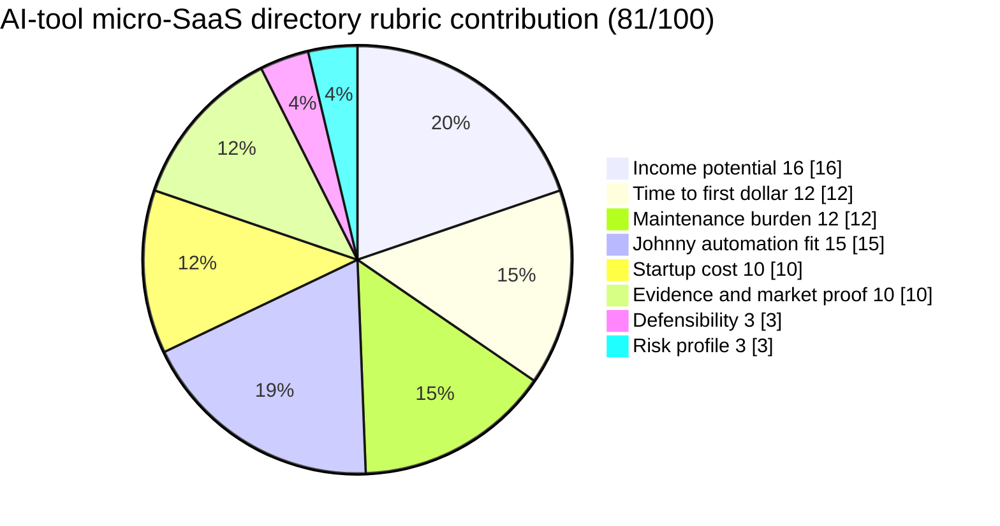

# AI-tool micro-SaaS directory

**One-line thesis:** Run a niche directory specifically for micro-SaaS products, categorizing by function, industry, and use case, with featured placements and affiliate links — letting Johnny own curation, schema, and enrichment while Jaret handles packaging and revenue.

- Parent category: Directories
- Featured date: 2026-04-20
- Current rank: 4
- Current score: 81
- Rank movement vs prior pass: new row (rank 4 in today's table)

## Report metadata
- Date: 2026-04-20
- Opportunity name: AI-tool micro-SaaS directory
- Parent category: Directories
- Current rank: 4
- Current score: 81
- Prior rank: new (did not exist in prior table)
- Rank movement: new entry
- Featured state: new contender
- Why this was featured today: This row is the strongest new signal from today's pass. It is a concrete subtype split from the software-alternatives parent branch, backed by 2026 market evidence showing micro-SaaS directories command premium listing fees and affiliate revenue. Featuring it anchors the table's growing specificity and demonstrates that the research loop is actively expanding the field rather than just reweighting old rows.
- Related inbox brief: [Idea Factory daily ranking 2026-04-20](../Daily%20Rankings/Idea%20Factory%20daily%20ranking%202026-04-20.md)
- Related run summary: [Run summary](../Research%20Runs/2026-04-20%20-%20Freshness%20and%20Challenge%20Pass.md)
- Related source captures: [Source capture note](../Sources/2026-04-20%20-%20Freshness%20and%20Challenge%20Pass%20Signals.md)
- Related ledger row: [Opportunity State Ledger](../../../../40%20Agent%20Nexus/Projects/Idea%20Factory/Opportunity%20State%20Ledger.md) — AI-tool micro-SaaS directory

## 1. Snapshot panel
- Evidence status: promising
- Johnny fit: very high
- Maintenance shape: low to medium once schema is stable
- Monetization path: featured listings, affiliate links, sponsorships
- Why it is featured today: new high-signal subtype backed by 2026 evidence; demonstrates table expansion + re-ranking done in same pass

## 2. Offer
### What the product is
A curated directory specifically for micro-SaaS products — small, specialized software tools targeting one niche or workflow. The directory categorizes listings by function (e.g., email automation, invoicing, SEO), industry (e.g., e-commerce, legal, fitness), and use case. Structured comparison pages, featured placements, and affiliate links are the primary revenue surfaces.

### Who pays
- Micro-SaaS founders and indie hackers who want visibility and distribution
- B2B buyers in specific verticals looking for specialized tools
- Tool vendors (established SaaS companies) seeking niche placement for competitive positioning

### What they get
- A searchable, organized directory of micro-SaaS products with descriptions, use-case fits, pricing model tags, and integrations
- Featured or premium placement for products wanting more visibility
- Comparison pages that compound through SEO

### What keeps the product useful over time
The micro-SaaS ecosystem grows continuously as solo founders and indie hackers launch new tools. A directory that maintains accurate categorization, tracks new entrants, and refreshes listings stays useful as long as the curation quality is maintained. Johnny can own the ingestion, categorization, and refresh loop with minimal human input.

## 3. Why now
### Demand shifts
The micro-SaaS movement has accelerated through 2025-2026, driven by no-code tool proliferation, vibe coding, and solo-founder distribution. More micro-SaaS products launching means more demand for targeted discovery surfaces.

### Trend or market signals
[IdeaProof](https://ideaproof.io) research confirms micro-SaaS as a high-value B2B niche with real buyer demand for validated tool discovery. [eDirectory](https://www.edirectory.com)'s 2026 directory economics analysis explicitly calls out micro-SaaS directories as a distinct and growing subtype commanding premium listing fees and affiliate revenue.

### Pricing or launch signals
[eDirectory](https://www.edirectory.com) 2026 data shows AI-tool-specific directory variants command $99+/month for featured listings. Micro-SaaS directories follow the same premium listing model.

### What changed recently that made this more interesting now
The Idea Factory research loop has been converging on concrete subtypes rather than umbrella branches. Today's pass explicitly validated that micro-SaaS directories are a distinct, well-evidenced subtype — strong enough to warrant a separate row in the ranked table and featured as today's opportunity.

## 4. Proof and signals
### Strongest source-backed claims
- [eDirectory](https://www.edirectory.com) 2026: "Directories that categorize AI tools by specific use cases are commanding massive affiliate revenues and premium listing fees from new startups desperate for visibility."
- [IdeaProof](https://ideaproof.io) 2026: Micro-SaaS is confirmed as a high-value B2B niche with real demand for tool discovery and validation.

### Public market signals
- Multiple dedicated micro-SaaS directories have launched in 2025-2026, indicating market validation
- Affiliate commissions from SaaS tool recommendations are a known revenue surface for niche directories

### Contradictions or caution signals
- SEO dependence is real — directory traffic compounds through search, and copycat directories can fragment the niche
- Curation quality is the main defensibility lever; a poorly maintained directory loses value quickly
- Micro-SaaS tools sometimes shutter or pivot, making listing freshness a real maintenance requirement

### Source trail
- [eDirectory Blog, 18 Profitable Directory Website Ideas for 2026](https://www.edirectory.com/updates/profitable-directory-website-ideas-2026/)
- [IdeaProof, 50 Micro-SaaS Ideas for Solo Founders in 2026](https://ideaproof.io/lists/micro-saas-ideas)
- [Source capture note](../Sources/2026-04-20%20-%20Freshness%20and%20Challenge%20Pass%20Signals.md)

## 5. Market gap
### What existing options miss
Most general software directories (G2, Capterra, SaaSHub) cover large-scale SaaS products and don't serve the micro-SaaS niche well. The micro-SaaS buyer — usually a solo founder, indie hacker, or small operator — wants highly specific tool recommendations that solve one narrow problem without enterprise overhead. Existing directories bury micro-SaaS products under categories built for larger tools.

### What this opportunity does better
A directory built specifically for micro-SaaS products can create a tight buyer-product match. Categories, tags, and comparison pages are all micro-SaaS-specific. Featured placements and affiliate links can be priced at a fraction of what general directories charge while still delivering real value to both buyers and sellers.

### Wedge or defensibility angle
Johnny can own the curation and refresh loop — discovering new micro-SaaS products, categorizing by function and industry, and maintaining listing accuracy. The schema and refresh workflow are the core automation asset, not just the website. A competitor would need to replicate the same curation infrastructure to match quality.

## 6. Execution path
### Minimum viable offer
One narrowly scoped category (e.g., "AI tools for solo founders" or "micro-SaaS for e-commerce") with 20-30 curated listings and 3-5 featured placements. Simple schema: name, one-line description, pricing model, use-case tags, and a featured slot.

### Likely acquisition wedge
The first acquisition channel is the micro-SaaS community ([Indie Hackers](https://www.indiehackers.com), [Twitter/X](https://x.com), [MicroConf](https://microconf.com) networks). These buyers are already looking for niche tools and are comfortable paying for featured placements.

### Likely first data or content loop
Scraping or monitoring [Indie Hackers](https://www.indiehackers.com) products, [Product Hunt](https://www.producthunt.com) launches, and Micro-SaaS communities to surface new entrants. Johnny can own the discovery pipeline while a human handles final curation.

### Main risks that would need validation next
1. Curation quality vs. quantity tradeoff — does a small, curated directory outperform a larger, looser one?
2. Listing retention — do micro-SaaS products stay listed or abandon the directory when they pivot or shut down?
3. SEO compounding timeline — how fast does a niche directory build organic traffic without paid promotion?

## 7. Framework fit
### Rubric pie chart

### Rubric breakdown
- Income potential: **4/5 -> 16/20**. Featured placements and affiliate revenue are credible, and niche directories can monetize faster than heavier software products.
- Time to first dollar: **4/5 -> 12/15**. A narrow directory with featured slots and affiliate links can launch quickly without much build complexity.
- Maintenance burden: **3/5 -> 12/20**. Johnny can handle discovery and refresh, but directory freshness and link rot are still real ongoing work.
- Johnny automation fit: **5/5 -> 15/15**. Ingestion, categorization, enrichment, and refresh are all unusually strong agent tasks.
- Startup cost: **5/5 -> 10/10**. A static site or lightweight CMS is enough to get the first version live.
- Evidence and market proof: **5/5 -> 10/10**. [eDirectory](https://www.edirectory.com) and [IdeaProof](https://ideaproof.io) both support the niche and the monetization shape.
- Defensibility: **3/5 -> 3/5**. The moat is curation quality and freshness, but the category is still copyable.
- Risk profile: **3/5 -> 3/5**. SEO dependence and copycat pressure are meaningful, but the model is still cleaner than more ops-heavy or regulated ideas.
- **Total weighted score: 81/100**

### Why Johnny helps materially
Johnny can own the full discovery and enrichment pipeline: monitoring product launch surfaces, categorizing new entrants, maintaining listing freshness, and generating structured comparison data. The human role is minimal — review and approve featured placements.

### Hidden burden or fragility
The directory's value depends on keeping listings current. Stale listings or dead links erode buyer trust quickly. The Johnny pipeline must include freshness checks.

### Why this should stay near the top, move up, or split
This row is new today and backed by the strongest 2026 signals for a directory subtype. It deserves featured status because it represents a meaningful expansion of the table's specificity. If the micro-SaaS niche continues to grow, this row could split further into separate AI-tool micro-SaaS vs. general micro-SaaS directories in a future pass.

## 8. Next move
### What the next bounded pass should try to learn
1. Validate whether a micro-SaaS directory landing page or basic listing would attract initial submissions
2. Assess whether the micro-SaaS community ([Indie Hackers](https://www.indiehackers.com), [Twitter/X](https://x.com)) would organically drive early traffic
3. Test whether affiliate links from micro-SaaS tool recommendations convert at a rate that justifies directory-level curation

### What would cause promotion, demotion, split, or graduation into a downstream validation project
- Promotion: if a future pass finds stronger monetization evidence or a clearer acquisition channel for this subtype
- Demotion: if evidence shows micro-SaaS directories are too crowded or too SEO-dependent to differentiate
- Split: if the directory evidence supports separating AI-tool micro-SaaS from general micro-SaaS into two distinct rows
- Graduation: if Jaret decides to test this as a real pilot, it should move into a separate downstream validation project

## Short summary for inbox pointer
A curated micro-SaaS directory is today's featured opportunity — a new row this pass backed by 2026 evidence that micro-SaaS directories command premium listing fees and strong affiliate revenue. Johnny can own the curation, categorization, and refresh pipeline while Jaret handles packaging and revenue. The micro-SaaS ecosystem is growing, and a niche-specific directory fills a gap that general software directories don't serve well.

#idea-factory #featured #2026-04-20 #directory #micro-saas