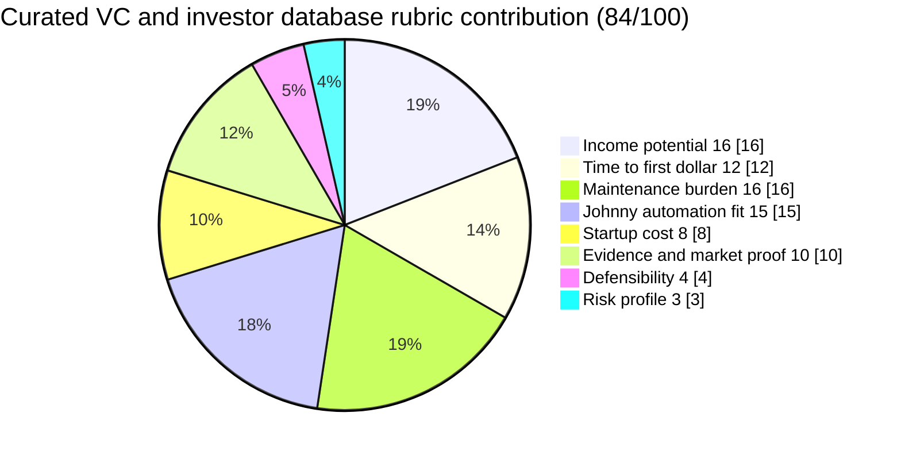

# Curated VC / investor database

**One-line thesis:** Maintain a sharply filtered investor database scoped to emerging VC funds (sub-$500M AUM), segmented by stage, sector, check size, and decision-maker fit, with optional paid refresh updates, making deal-sourcing more efficient for founders and operators in a 2026 market where fund formation has slowed and inboxes are less crowded at the emerging-fund level.

- Parent category: Data product
- Featured date: 2026-04-21
- Current rank: 2
- Current weighted score: 84
- Rank movement vs prior pass: promoted from rank 3 to rank 2 (+1)

## Report metadata
- Date: 2026-04-21
- Opportunity name: Curated VC / investor database
- Parent category: Data product
- Current rank: 2
- Current weighted score: 84
- Prior rank: 3
- Rank movement: +1 (promoted)
- Featured state: promoted
- Why this was featured today: This row moved from rank 3 to rank 2 this pass and had the strongest fresh market-structure evidence in the top tier. VC fund formation is slowing, making deal-sourcing efficiency more valuable, and emerging VC funds (sub-$500M AUM) are demonstrably more accessible and more likely to respond to outreach than established brands. The row's buyer-persona segmentation (GP/IR vs. wealth teams vs. Salesforce-native) remains the key differentiator. It is not the static rank-1 row, but it had the clearest decision value today.
- Related inbox brief: [Idea Factory daily ranking 2026-04-21](../Daily%20Rankings/Idea%20Factory%20daily%20ranking%202026-04-21.md)
- Related run summary: [Run summary](../Research%20Runs/2026-04-21%20-%20Contradiction%20and%20Market%20Structure%20Pass.md)
- Related source captures: [Source capture note](../Sources/2026-04-21%20-%20Contradiction%20and%20Market%20Structure%20Pass%20Signals.md)
- Related ledger row: [Opportunity State Ledger](../../../../40%20Agent%20Nexus/Projects/Idea%20Factory/Opportunity%20State%20Ledger.md) — Curated VC / investor database

## 1. Snapshot panel
- Evidence status: promising
- Johnny fit: high
- Maintenance shape: medium because contacts and fit signals decay
- Monetization path: one-time access, update subscription, premium tiers
- Why it is featured today: strongest fresh 2026 market-structure evidence among the top-ranked rows, plus meaningful movement and clear downstream decision value

## 2. Offer
### What the product is
A sharply filtered investor database scoped to emerging VC funds (sub-$500M AUM), with structured data on stage, sector, check size, decision-maker fit, and recent activity. Optional paid refresh updates keep the data current. The database is thesis-driven, filtered for quality over quantity, so founders and operators can spend less time researching and more time executing.

### Who pays
- Early-stage founders building a fundraising strategy
- Operators and BD professionals sourcing investors for a specific deal
- IR teams at emerging funds tracking peer activity
- Wealth managers and family offices looking for VC access

### What they get
- A curated, high-signal list of emerging VC funds instead of a bloated database of every fund that ever existed
- Segmentation by stage, sector, check size, and decision-maker fit
- Optional refresh updates when the fund landscape shifts
- Confidence that the funds in the database are actually accessible and likely to respond

### What keeps the product useful over time
The VC market is constantly shifting, new funds launch, existing funds shift strategy, partners rotate, and check sizes change. A database that maintains accurate, filtered data on emerging funds stays useful as long as the curation quality is maintained. Johnny can own the monitoring pipeline: tracking new fund announcements, monitoring [LinkedIn](https://www.linkedin.com) and public sources for emerging fund activity, and updating the segmentation.

## 3. Why now
### Demand shifts
VC fund formation is slowing in 2026. According to [Fidelity Private Shares](https://www.fidelityprivateshares.com), if you're not an AI or software company in a capital-dense ecosystem, you're competing for a smaller share of a more selective pool. This means founders and operators need more targeted, efficient outreach, not more mass outreach into a shrinking market.

### Trend or market signals
Max Pog's [LinkedIn](https://www.linkedin.com) distribution of an emerging VC fund database got traction precisely because emerging funds are more accessible and less inbox-clogged than established brands. The market is signaling that a filtered database of emerging funds is more useful than a broad VC database.

### Pricing or launch signals
[Crustdata](https://crustdata.com)'s analysis of startup databases for investors confirms that even generalist databases like PitchBook have coverage lags in fast-moving markets, which is the opening for a more targeted, faster-refresh database. [CDP.Center](https://www.cdp.center) confirms a $20k+ annual floor for generalist VC databases, validating that the buyer will pay for structured investor data.

### What changed recently that made this more interesting now
The 2026 market structure shifted: fund formation slowed, making deal-sourcing efficiency more valuable, and emerging VC funds became demonstrably more accessible. The contradiction pass this week challenged the prior rank-1 row and found that a narrower, more specific investor database had stronger fresh evidence and more immediate decision value.

## 4. Proof and signals
### Strongest source-backed claims
- [Fidelity Private Shares](https://www.fidelityprivateshares.com) 2026: fund formation is slowing and founders outside the hottest clusters are competing for a more selective pool.
- Max Pog [LinkedIn](https://www.linkedin.com): emerging VC funds are more likely to respond than famous VCs because their inboxes are less saturated.
- [Crustdata](https://crustdata.com): broad databases lag in real-time discovery for fast-moving sectors, leaving room for narrower, faster-refresh products.

### Public market signals
- [CDP.Center](https://www.cdp.center) confirms a $20k+ annual floor for VC databases, validating serious buyer demand.
- [Altss](https://altss.com) confirms buyer-persona segmentation (GP/IR vs. wealth teams vs. Salesforce-native) is the key differentiator.
- OpenVC has SaaS-focused investor lists, confirming the market for segmented investor data.

### Contradictions or caution signals
- Data freshness is the main hidden cost, contacts and fit signals decay over time.
- Narrowing to emerging funds reduces the total addressable market but increases signal quality.
- The product shape requires ongoing maintenance to stay accurate.

### Source trail
- [Fidelity Private Shares, Venture Capital in 2026: What the Latest Data Reveals for Founders](https://www.fidelityprivateshares.com/blog/venture-capital-in-2026-what-the-latest-data-reveals-for-founders)
- [Max Pog on [LinkedIn](https://www.linkedin.com), Database of 84 emerging VC funds](https://www.linkedin.com/posts/maxpog_i-can-share-a-database-of-84-emerging-vc-activity-7440735996209434624-1fUd)
- [Crustdata, 7 Best Startup Databases for Investors in 2026](https://crustdata.com/blog/7-best-startup-databases-for-investors-in-2026)
- [CDP.Center, Top Venture Capital Databases & Data Sources (2026 Guide)](https://www.cdp.center/post/venture-capital-data-sources)
- [Altss, Best Investor & LP Databases in 2026](https://altss.com/blog/best-investor-and-lp-databases-in-2026)
- [Source capture note](../Sources/2026-04-21%20-%20Contradiction%20and%20Market%20Structure%20Pass%20Signals.md)

## 5. Market gap
### What existing options miss
Generalist VC databases (PitchBook, Crunchbase) are comprehensive but slow-refresh and designed for institutional teams with enterprise budgets. They miss the emerging-fund segment, funds under $500M AUM that are actively deploying capital but do not have the brand recognition to fill every inbox. Founders targeting these emerging funds need a filtered database that prioritizes accessibility and fit over brand.

### What this opportunity does better
A curated database scoped to emerging VC funds delivers higher signal per record than a broad database. The buyer-persona segmentation allows for more targeted outreach and higher conversion rates. The human editor plus Johnny pipeline can maintain freshness at a level that enterprise databases cannot match for this specific segment.

### Wedge or defensibility angle
Johnny can own the discovery and monitoring pipeline: tracking new fund announcements, monitoring decision-maker changes, and updating the segmentation. The curation quality is the defensibility, a competitor would need to replicate the same monitoring and filtering infrastructure to match the signal quality.

## 6. Execution path
### Minimum viable offer
One narrowly scoped segment, for example "emerging AI/ML VC funds under $300M AUM actively investing in 2026," with 50 to 100 curated entries, each with decision-maker name, check size range, stage focus, and last active date. Simple segmentation tags for stage, sector, and check size.

### Likely acquisition wedge
The first acquisition channel is founder communities ([Indie Hackers](https://www.indiehackers.com), [Twitter/X](https://x.com), [MicroConf](https://microconf.com) networks) and startup advisors who help founders with fundraising strategy. These buyers are already spending time researching investors and would pay for a filtered, high-signal database.

### Likely first data or content loop
Johnny monitors [LinkedIn](https://www.linkedin.com) posts, VC announcement feeds, and emerging-fund lists to surface new entries. Human handles final curation and segmentation quality control.

### Main risks that would need validation next
1. Churn risk, does the database retain subscribers when fund landscapes shift?
2. Refresh burden, how much human time is needed to keep the data current?
3. Buyer segment fit, which buyer persona has the strongest willingness to pay?

## 7. Framework fit
### Rubric pie chart

### Rubric breakdown
- Income potential: **4/5 -> 16/20**. Serious buyer value and premium pricing potential, but narrower than a massive generalist database.
- Time to first dollar: **4/5 -> 12/15**. A small curated MVP can be sold quickly once the first filtered list exists.
- Maintenance burden: **4/5 -> 16/20**. Ongoing refresh is real, but the monitoring and enrichment loop is highly automatable.
- Johnny automation fit: **5/5 -> 15/15**. Discovery, tracking, enrichment, and change detection are all strong agent tasks.
- Startup cost: **4/5 -> 8/10**. Cheap to launch as a research product; main cost is curation time, not software build.
- Evidence and market proof: **5/5 -> 10/10**. Multiple sources confirm buyers pay for investor data and that sharper segmentation matters.
- Defensibility: **4/5 -> 4/5**. Freshness plus emerging-fund focus creates a meaningful niche edge.
- Risk profile: **3/5 -> 3/5**. Data decay and competition are real, but this is cleaner than regulated or support-heavy models.
- **Total weighted score: 84/100**

### Why Johnny helps materially
Johnny can own the monitoring pipeline: tracking new fund announcements, monitoring decision-maker changes, and enriching the database with fresh signals. The human role is review and quality control, not raw data acquisition.

### Hidden burden or fragility
The database's value depends on keeping data fresh. Stale entries or inaccurate fit signals erode buyer trust quickly. The Johnny pipeline must include freshness checks and regular update cycles.

### Why this should stay near the top, move up, move down, or split
This row moved up because the 2026 market-structure evidence strongly supports the emerging-fund niche. If the VC market continues to slow, deal-sourcing efficiency demand will grow. The row is specific, differentiated, and well-evidenced. If evidence shows the buyer segment is narrower than expected, the row could split into separate founder-facing vs. operator-facing products.

## 8. Next move
### What the next bounded pass should try to learn
1. Validate the buyer segment, which persona has the strongest willingness to pay and the clearest use case?
2. Assess the data acquisition burden, how much human time is needed to build an initial high-quality list of 50 to 100 emerging VC funds?
3. Test whether the refresh pipeline can be mostly automated or requires significant human curation on an ongoing basis.

### What would cause promotion, demotion, split, or graduation into a downstream validation project
- Promotion: if a future pass finds stronger monetization evidence or a clearer buyer persona for this specific segment.
- Demotion: if evidence shows the VC market is recovering and emerging-fund accessibility is no longer a differentiator.
- Split: if the evidence supports separating founder-facing vs. operator-facing buyer personas into distinct rows.
- Graduation: if Jaret decides to test this as a real pilot, it should move into a separate downstream validation project.

## Short summary for inbox pointer
The curated VC / investor database is today's featured opportunity, promoted to rank 2 with strong 2026 evidence that emerging VC funds are more accessible and that deal-sourcing efficiency matters more in a slowing fund-formation market. A sharply filtered database scoped to sub-$500M AUM emerging funds with buyer-persona segmentation is the specific wedge, and Johnny can own the monitoring pipeline while Jaret handles packaging and revenue.

#idea-factory #featured #research #vc-database