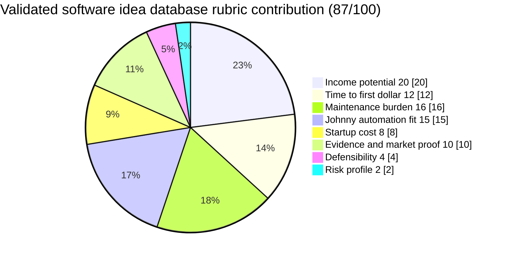

# Validated software idea database / opportunity feed

**One-line thesis:** Sell a ranked, thesis-driven feed of software opportunities, broken markets, and underserved niches with ongoing refresh, scoring, and evidence trails, so founders pay to avoid wasting months building the wrong thing.

- Parent category: Data product
- Featured date: 2026-04-22
- Current rank: 1
- Current weighted score: 87
- Rank movement vs prior pass: held at rank 1

## Report metadata
- Date: 2026-04-22
- Opportunity name: Validated software idea database / opportunity feed
- Parent category: Data product
- Current rank: 1
- Current score: 87
- Prior rank: 1
- Rank movement: held
- Featured state: holding strong
- Why this was featured today: This row had the strongest fresh evidence in the current pass, remained the highest-scoring row in the table, and had not yet received a featured memo. The 2026 evidence sharpened the buyer pain clearly: founders are already paying for structured validation because the cost of getting it wrong is much higher than the cost of buying better research.
- Related inbox brief: [Idea Factory daily ranking 2026-04-22](../Daily%20Rankings/Idea%20Factory%20daily%20ranking%202026-04-22.md)
- Related run summary: [Run summary](../Research%20Runs/2026-04-22%20-%20Freshness%20and%20Adjacency%20Expansion%20Pass.md)
- Related source captures: [Source capture note](../Sources/2026-04-22%20-%20Freshness%20and%20Adjacency%20Expansion%20Pass%20Signals.md)
- Related ledger row: [Opportunity State Ledger](../../../../40%20Agent%20Nexus/Projects/Idea%20Factory/Opportunity%20State%20Ledger.md) — Validated software idea database / opportunity feed

## 1. Snapshot panel
- Evidence status: promising
- Johnny fit: very high
- Maintenance shape: low to medium if sourcing and scoring stay disciplined
- Monetization path: subscription, quarterly access, premium archive, upsells
- Why it is featured today: strongest fresh proof in the top tier, highest total weighted score in the table, and clearer buyer pain than the earlier passes had captured

## 2. Offer
### What the product is
A continuously updated database of validated software opportunities, broken markets, and underserved niches. Each entry is scored, summarized, and linked to supporting evidence so a founder is not buying random startup ideas, they are buying a ranked decision surface.

### Who pays
- Solo founders and indie hackers choosing what to build next
- Small startup teams that want a faster way to screen opportunity spaces
- Advisors, operators, or studio teams that want a thesis-driven idea pipeline

### What they get
- Ranked opportunities with short thesis summaries
- Evidence-backed notes on demand, competition, and likely monetization shape
- Filters by buyer type, niche, market pain, or business model
- Ongoing refresh instead of a one-time static PDF or brainstorm dump

### What keeps the product useful over time
Founders always need better filters for what to build next. The product stays useful if the feed keeps turning raw signal into legible ranked opportunities with clear reasons for movement. Johnny can own the recurring signal collection, scoring, synthesis, and refresh loop.

## 3. Why now
### Demand shifts
Founder demand for structured validation is getting easier to justify. [SegmentOS](https://segmentos.io) reports that 72% of new products still fail within 18 months, and founders who used formal validation tools were 2.4x more likely to hit their first-year revenue targets.

### Trend or market signals
[IdeaProof](https://ideaproof.io)'s 2,353+ idea corpus and [BigIdeasDB](https://bigideasdb.com)'s complaint-plus-revenue methodology both confirm there is real appetite for research-backed opportunity feeds, not just free brainstorming content.

### Pricing or launch signals
The average founder in the [SegmentOS](https://segmentos.io) study spent $4,200 reworking product after launch due to unvalidated assumptions. That makes a paid validation feed feel like cost avoidance, not a luxury purchase.

### What changed recently that made this more interesting now
Earlier passes established that validated idea feeds are real. Today's pass clarified why buyers pay: the cost of building the wrong thing is high, and structured validation correlates with materially better outcomes. That makes this row feel more durable and less hype-dependent.

## 4. Proof and signals
### Strongest source-backed claims
- [SegmentOS](https://segmentos.io): only 23% of founders used structured research methods with their actual target market
- [SegmentOS](https://segmentos.io): founders using formal validation tools were 2.4x more likely to hit first-year revenue targets
- [SegmentOS](https://segmentos.io): average founder spent $4,200 reworking product post-launch due to unvalidated assumptions
- [IdeaProof](https://ideaproof.io): large searchable validated startup-ideas corpus confirms the market is real
- [BigIdeasDB](https://bigideasdb.com): complaint mining plus tracked startup revenue confirms a credible methodology for sourcing opportunities

### Public market signals
- Active products already exist in the validated-ideas space
- Solo-founder toolkits now explicitly include paid research and validation tools
- Indie hacker demand keeps favoring narrower, better-evidenced starting points over broad idea lists

### Contradictions or caution signals
- Competition is real, so a generic idea list will not be enough
- The moat is weak if the feed becomes just another list without strong scoring discipline or differentiation
- Distribution still matters, even if the product itself is lightweight

### Source trail
- [SegmentOS, State of Startup Idea Validation 2026](https://segmentos.io/blog/state-of-startup-idea-validation-2026)
- [IdeaProof, Startup Ideas Database 2026](https://ideaproof.io/startup-ideas-database)
- [BigIdeasDB, How to Find Startup Ideas in 2026](https://bigideasdb.com/how-to-find-startup-ideas-2026)
- [BigIdeasDB, Solopreneur SaaS Toolkit 2026](https://bigideasdb.com/solopreneur-saas-toolkit-2026)
- [Source capture note](../Sources/2026-04-22%20-%20Freshness%20and%20Adjacency%20Expansion%20Pass%20Signals.md)

## 5. Market gap
### What existing options miss
Most idea products are either too shallow, too generic, or too static. Founders get lists, trend bait, or brainstorm dumps without enough evidence to decide quickly.

### What this opportunity does better
A ranked feed with evidence trails helps founders buy time and confidence, not just inspiration. The value is in the refresh loop, the scoring discipline, and the explanation of why an opportunity belongs near the top.

### Wedge or defensibility angle
The wedge is repeatable research quality plus ongoing ranking movement. If Johnny can keep pulling real signals into a cleaner scoring system than competitors, the product compounds into a better decision layer over time.

## 6. Execution path
### Minimum viable offer
A narrow starter feed with 25 to 50 ranked opportunities, each with a one-paragraph thesis, brief evidence trail, and a clear buyer or niche tag. Offer one paid tier for the live feed and one premium tier for deeper archived entries.

### Likely acquisition wedge
The first buyer wedge is not broad startup marketing. It is founder communities where people are already asking what to build, what niche to enter, or how to validate before they waste a few months. The most plausible early surfaces are [Indie Hackers](https://www.indiehackers.com), build-in-public founders on [X](https://x.com), startup and solo-founder newsletters, and communities adjacent to [MicroConf](https://microconf.com).

### Likely first buyer-finding motion
- Publish a small free sample of ranked opportunities each week, then point interested founders to the fuller paid feed
- Post short evidence-backed breakdowns in places like [Indie Hackers](https://www.indiehackers.com) and on [X](https://x.com) where founders already discuss what to build next
- Partner with founder newsletters, startup communities, or advisors who already curate tools and opportunities for early-stage builders
- Offer a narrow founder-facing entry product first, such as one vertical slice, one monthly drop, or one premium brief, rather than trying to sell a huge database immediately

### Likely first data or content loop
Johnny monitors complaint-heavy surfaces, product reviews, launch signals, founder discussions, and niche market shifts, then turns those into ranked opportunities with recurring updates. A portion of that output can double as top-of-funnel content, because the same research that makes the product useful also creates short public teasers that help founders discover it.

### Main risks that would need validation next
1. Does the buyer want a live feed or a recurring report package?
2. Which segment pays fastest: solo founders, startup studios, or operators?
3. How much differentiation is needed to avoid looking like a copycat idea database?

## 7. Framework fit
### Rubric pie chart

### Rubric breakdown
- Income potential: **5/5 -> 20/20**. Founders already pay for validation and research products, and the offer can support subscription, archive, and premium-brief tiers rather than a single low-ticket sale.
- Time to first dollar: **4/5 -> 12/15**. A narrow paid feed can be sold quickly once the first ranked set is credible, even before a larger database exists.
- Maintenance burden: **4/5 -> 16/20**. Ongoing refresh is real, but the work is mostly structured research, scoring, and synthesis instead of heavy custom service delivery.
- Johnny automation fit: **5/5 -> 15/15**. Continuous signal gathering, deduping, ranking, and summarizing are exactly the kind of recurring work Johnny can do well.
- Startup cost: **4/5 -> 8/10**. This can launch as a research product with lightweight delivery, so the main cost is disciplined curation rather than software buildout.
- Evidence and market proof: **5/5 -> 10/10**. Multiple live products and fresh 2026 validation evidence show that buyers already pay for structured opportunity research.
- Defensibility: **4/5 -> 4/5**. The moat is not raw data alone, but repeatable research quality, evidence trails, and ranking discipline that improve over time.
- Risk profile: **2/5 -> 2/5**. The biggest risks are commoditization and distribution, but the model is still cleaner than more ops-heavy or support-heavy ideas.
- Total weighted score: **87/100**

### Why Johnny helps materially
Johnny is unusually well-matched to the hard part: continuous signal gathering, deduping, ranking, summarizing, and re-scoring. That turns a fragile brainstorm product into a maintained research surface.

### Hidden burden or fragility
If the scoring gets sloppy or the feed goes stale, trust collapses fast. The product also needs a sharper wedge than just "startup ideas," because generic lists are easy to copy.

### Why this should stay near the top, move up, move down, or split
It should stay near the top because the evidence is strong, the buyer pain is expensive, and Johnny's advantage is real. It should move down if the space starts looking commoditized or if distribution proves much harder than expected. It could split later into narrower founder-facing subtypes if one wedge clearly outperforms the broader feed.

## 8. Next move
### What the next bounded pass should try to learn
Figure out which wedge is strongest: founder-facing live feed, premium archived opportunity library, or deeper bundled briefs tied to top-ranked entries.

### What would cause promotion, demotion, split, or graduation into a downstream validation project
- Promotion: stronger proof that one buyer segment pays quickly for the feed
- Demotion: evidence that the category is too copyable or too distribution-heavy without a sharper moat
- Split: one subtype clearly outperforms the broader feed, such as founder-facing live signals versus investor-ready opportunity briefs
- Graduation: Jaret decides this row is worth a dedicated validation or launch project

## Short summary for inbox pointer
Today's featured opportunity is the validated software idea database, still rank 1 with the strongest fresh evidence in the table. The key shift is that the buyer pain is clearer now: founders are not just buying ideas, they are paying to avoid expensive validation mistakes, and Johnny is unusually well-suited to run the signal-gathering and scoring loop that makes the feed valuable.

#idea-factory #featured #research #validated-ideas