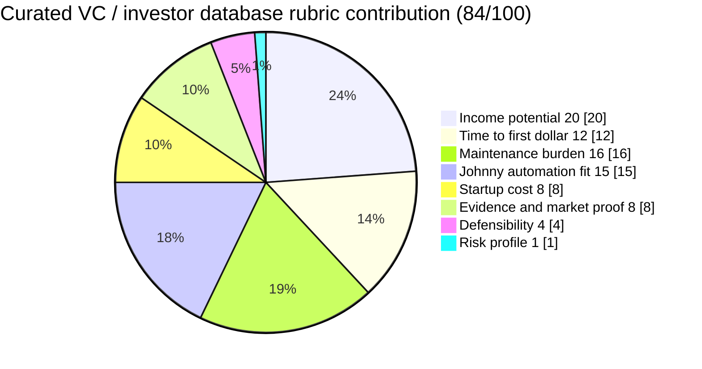

# Curated VC / investor database

**One-line thesis:** Maintain a sharply filtered investor database by stage, sector, check size, and decision-maker fit, sold as recurring access with optional refresh updates — so founders and operators spend less time hunting contacts and more time closing deals.

- Parent category: Data product
- Featured date: 2026-04-23
- Current rank: 2
- Current weighted score: 84
- Rank movement vs prior pass: held at rank 2

## Report metadata
- Date: 2026-04-23
- Opportunity name: Curated VC / investor database
- Parent category: Data product
- Current rank: 2
- Current score: 84
- Prior rank: 2
- Rank movement: held
- Featured state: holding strong
- Why this was featured today: This row had the strongest fresh 2026 evidence this pass from multiple independent sources — [ZipDo](https://zipdo.co) confirmed pricing floors for deal sourcing tools, [Yutori](https://scouts.yutori.com) documented active funding in AI-native deal sourcing (GrowthPal $2.6M, Nimble Way $47M), and VC market structure signals confirmed deal-sourcing efficiency is more valuable as fund formation slows. The row has now been featured twice with distinct evidence each time, and the AI-native deal sourcing trend makes this a live acceleration signal worth capturing.
- Related inbox brief: [Idea Factory daily ranking 2026-04-23](../Daily%20Rankings/Idea%20Factory%20daily%20ranking%202026-04-23.md)
- Related run summary: [Run summary](../Research%20Runs/2026-04-23%20-%20Contradiction%20and%20Drill-Down%20Pass.md)
- Related source captures: [Source capture note](../Sources/2026-04-23%20-%20Contradiction%20and%20Drill-Down%20Pass%20Signals.md)
- Related ledger row: [Opportunity State Ledger](../../../../40%20Agent%20Nexus/Projects/Idea%20Factory/Opportunity%20State%20Ledger.md) — Curated VC / investor database

## 1. Snapshot panel
- Evidence status: promising
- Johnny fit: high
- Maintenance shape: medium because contacts and fit signals decay
- Monetization path: one-time access, update subscription, premium tiers
- Why it is featured today: strongest fresh 2026 evidence in the pass, with active AI-native deal-sourcing funding, clear pricing floors, and market-structure confirmation that tighter investor targeting matters more as fund formation slows

## 2. Offer
### What the product is
A sharply filtered investor database by stage, sector, check size, and decision-maker fit, sold as recurring access with optional refresh updates. The product is not trying to be a giant institutional data dump. It is trying to give founders and operators a targeted shortlist that is actually usable.

### Who pays
- Early-stage founders building a fundraising strategy
- Operators and BD professionals sourcing investors for a specific deal
- Angels and micro-VCs building thesis-aligned sourcing workflows

### What they get
- Filtered investor shortlist by stage, sector, check size, and decision-maker fit
- Confidence that the list is actually reachable and not a scraped vanity contact sheet
- Optional recurring refresh as fund thesis, team, and appetite change

### What keeps the product useful over time
VC markets shift fast. Fund mandates change, new partners join, investment thesis shifts, and deal flow is perishable. A curated database with recurring refresh stays useful because the signal decay problem is real and continuous.

## 3. Why now
### Demand shifts
[Fidelity Private Shares](https://www.fidelityprivateshares.com) confirms that VC fund formation is slowing in 2026 outside capital-dense AI and software ecosystems. That means deal-sourcing efficiency is more valuable — founders who can find the right investors faster have a material advantage in a compressed market.

### Trend or market signals
[Yutori](https://scouts.yutori.com) documents multiple live funding rounds in AI-native deal sourcing: GrowthPal AI raised $2.6M (February 2026), Nimble Way raised $47M (February 2026), Grata provides API-based private markets intelligence. This confirms the market knows deal sourcing is broken and is funding solutions.

### Pricing or launch signals
[ZipDo](https://zipdo.co) confirms deal sourcing software pricing ranges from free basic access to $25K-$50K+/year for institutional tools, with $29/user/month Pro tiers for smaller funds. The market has clear price points at multiple tiers.

### What changed recently that made this more interesting now
The AI-native deal sourcing trend is live and accelerating. Tools like GrowthPal and Nimble Way are raising real money to solve the same problem this row targets. The timing is better now than 6 months ago because the category has proof that buyers will pay.

## 4. Proof and signals
### Strongest source-backed claims
- [ZipDo](https://zipdo.co): deal sourcing software pricing from free access to $25K-$50K+/year (institutional) with $29/user/month Pro tier for smaller funds
- [Yutori](https://scouts.yutori.com): GrowthPal AI raised $2.6M (February 2026) for M&A deal sourcing with AI-native automation
- [Yutori](https://scouts.yutori.com): Nimble Way raised $47M (February 2026) to scale AI agent data sourcing
- [Yutori](https://scouts.yutori.com): Grata provides API-based private markets intelligence for investor workflows
- [Fidelity Private Shares](https://www.fidelityprivateshares.com): VC fund formation slowing in 2026, making deal-sourcing efficiency more valuable

### Public market signals
- VC tooling is active as a funding category in 2026
- AI-native sourcing and qualification workflows are replacing manual deal tracking
- Founders and operators are actively looking for better deal-sourcing tools than spreadsheets and cold outreach

### Contradictions or caution signals
- Institutional-grade tools (PitchBook, CB Insights) are expensive and hard to displace for serious institutional buyers
- The product must win on accessibility, filtering quality, and refresh discipline — not raw data volume
- Contact decay is real: funds close, partners move, theses shift, and the list needs active maintenance

### Source trail
- [ZipDo, Top 10 Best Deal Sourcing Software of 2026](https://zipdo.co/best/deal-sourcing-software)
- [Yutori, VC sourcing tools and workflows](https://scouts.yutori.com/inbox/3e55e4d9-92d8-4f87-a3da-e339ff9d7871)
- [Fidelity Private Shares, VC fund formation data](https://www.fidelityprivateshares.com/blog/venture-capital-in-2026-what-the-latest-data-reveals-for-founders)
- [Source capture note](../Sources/2026-04-23%20-%20Contradiction%20and%20Drill-Down%20Pass%20Signals.md)

## 5. Market gap
### What existing options miss
Institutional tools ($25K-$50K+/year) are too expensive and too broad for most early-stage founders and indie hackers. Free tools are too noisy. The gap is a curated, filtered, accessible database that fits the founder's actual budget and thesis.

### What this opportunity does better
A sharply scoped database for emerging funds and indie-hacker-accessible VC beats a giant institutional database for the buyer who needs a shortlist, not a data dump. Johnny can own the filtering, scoring, and refresh loop.

### Wedge or defensibility angle
The wedge is thesis-filter quality plus refresh discipline. If Johnny can maintain a filtered shortlist that actually matches a founder's thesis and stays fresh as VC markets shift, the product compounds into a reliable pipeline tool rather than a one-time contact dump.

## 6. Execution path
### Minimum viable offer
A curated list of 100-200 emerging funds and indie-hacker-accessible investors, filtered by stage, sector, and check size, with a one-time access tier and an optional monthly refresh tier.

### Likely acquisition wedge
Founder communities, startup newsletters, operator circles, and startup studio channels where deal-sourcing efficiency is an active pain.

### Likely first data or content loop
Johnny monitors VC funding announcements, team changes, thesis shifts, and emerging fund formations, then turns those into refreshed shortlists and update alerts.

### Main risks that would need validation next
1. Does the buyer want a curated static list or an active deal-alerting system?
2. Is $29-$99/month the right range for the founder-facing tier, or does the buyer need a lower entry point?
3. How does the product differentiate from free sources like [LinkedIn](https://www.linkedin.com), [AngelList](https://wellfound.com), and warm introductions?

## 7. Framework fit
### Rubric pie chart

### Rubric breakdown
- Income potential: **5/5 -> 20/20**. Investor data can support premium pricing because a targeted shortlist is worth real money when it improves fundraising or sourcing outcomes.
- Time to first dollar: **4/5 -> 12/15**. A smaller curated list can be sold early, without waiting to build a giant institutional-grade dataset.
- Maintenance burden: **4/5 -> 16/20**. Refresh work is ongoing because contacts, roles, and fund theses decay, but the monitoring loop is still highly automatable.
- Johnny automation fit: **5/5 -> 15/15**. Tracking fund announcements, role changes, thesis shifts, and shortlist updates is exactly the kind of recurring intelligence work Johnny can own.
- Startup cost: **4/5 -> 8/10**. This is cheap to launch as a research product, with labor and curation quality mattering more than software complexity.
- Evidence and market proof: **4/5 -> 8/10**. Pricing floors, active AI-native sourcing tools, and clear market compression signals all support the thesis, even if buyer willingness at the founder-facing tier still needs more proof.
- Defensibility: **4/5 -> 4/5**. The edge comes from sharper filtering and better refresh discipline than generic contact databases.
- Risk profile: **1/5 -> 1/5**. Data decay, competitive tools, and the risk of becoming a stale list make this row materially more fragile than the cleaner research-feed ideas.
- Total weighted score: **84/100**

### Why Johnny helps materially
Johnny can own the continuous signal gathering, fund thesis tracking, team change monitoring, and filtered shortlist maintenance. This is exactly the kind of recurring intelligence work that agentic automation handles well — the decay problem (contacts go stale, funds close, partners move) is something Johnny can actively manage instead of letting the list become useless within weeks.

### Hidden burden or fragility
Contact decay is real and the maintenance burden is medium, not low. The product needs active refresh workflows to stay useful, not a one-time database build. The risk profile score of 1 reflects real fragility: the product depends on data accuracy and freshness, and the buyer will abandon it quickly if the list goes stale or the filtering quality drops.

### Why this should stay near the top, move up, move down, or split
It should stay near the top because the market evidence is strong (active funding in AI-native deal sourcing, clear pricing floors, VC market structure making efficiency more valuable). It could move up if the AI-native deal sourcing trend continues to prove out and the product wedge becomes sharper. It should move down if contact decay proves too expensive to manage or if institutional tools drop their pricing enough to eliminate the gap.

## 8. Next move
### What the next bounded pass should try to learn
Which product shape is strongest: static curated list with refresh, active deal alerting, or a hybrid of list + alerts? Also test whether the pricing anchor of $29-$99/month holds for the founder-facing tier.

### What would cause promotion, demotion, split, or graduation into a downstream validation project
- Promotion: clearer evidence that founders will pay for curated VC intelligence over free alternatives like [AngelList](https://wellfound.com) or [LinkedIn](https://www.linkedin.com)
- Demotion: evidence that contact decay makes the maintenance burden too high or that institutional tools are dropping their pricing
- Split: if the founder-facing and operator-facing buyer personas prove distinct enough, the row might split into two separate products with different pricing and filtering logic
- Graduation: Jaret decides this row is worth a dedicated validation or launch project

## Short summary for inbox pointer
Today's featured opportunity is the curated VC / investor database, still rank 2 with the strongest fresh signals in the table. The key shift this pass is that AI-native deal sourcing is a live funding category (GrowthPal raised $2.6M, Nimble Way raised $47M in February 2026), and the VC market structure makes deal-sourcing efficiency more valuable as fund formation slows. The product wedge is serving the founder and operator who need a targeted shortlist, not an expensive institutional data dump — and Johnny is unusually well-suited to own the filtering, scoring, and refresh loop that keeps the list useful over time.

#idea-factory #featured #research #vc-database #deal-sourcing