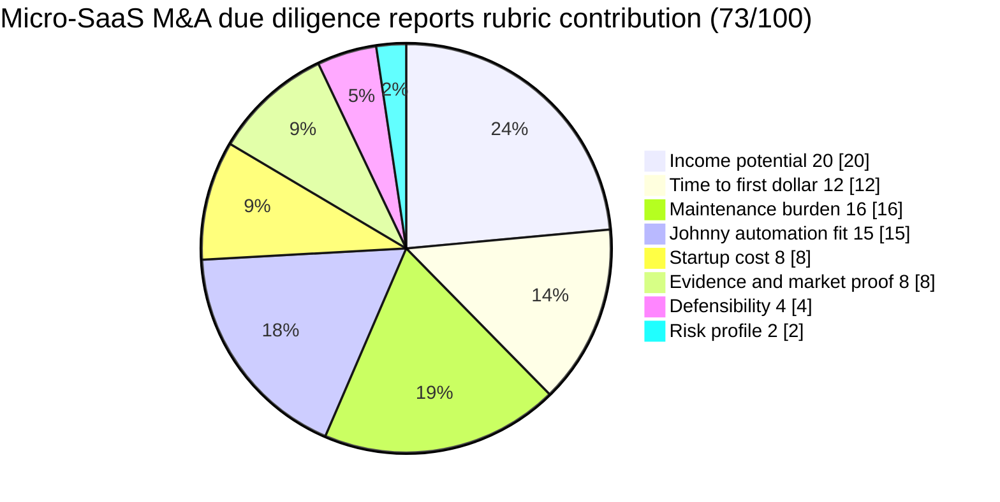

# Micro-SaaS M&A due diligence reports

**One-line thesis:** Sell structured due diligence report packages to micro-SaaS acquisition buyers on [Acquire.com](https://acquire.com), [Flippa](https://flippa.com), Microns, and similar marketplaces — so they can make smarter decisions before paying 6-10% broker fees on $200K-$500K deals.

- Parent category: Data product
- Featured date: 2026-04-24
- Current rank: 9
- Current weighted score: 73
- Rank movement vs prior pass: new row this pass

## Report metadata
- Date: 2026-04-24
- Opportunity name: Micro-SaaS M&A due diligence reports
- Parent category: Data product
- Current rank: 9
- Current score: 73
- Prior rank: N/A (new row this pass)
- Rank movement: new
- Featured state: new contender
- Why this was featured today: This row has the strongest novelty-and-decision-value combination in today's pass. It is a new row with direct buyer demand confirmation ([Indie Hackers](https://www.indiehackers.com) post), clear pricing anchor (replaces 6-10% broker fee on $200K-$500K deals with a $99-$499 report), and Johnny is unusually well-suited to own the template building, market monitoring, and report assembly workflow. The row has not been featured before and anchors the pass's core finding.
- Related inbox brief: [Idea Factory daily ranking 2026-04-24](../Daily%20Rankings/Idea%20Factory%20daily%20ranking%202026-04-24.md)
- Related run summary: [Run summary](../Research%20Runs/2026-04-24%20-%20Drill-Down%20and%20Adjacency%20Pass.md)
- Related source captures: [Source capture note](../Sources/2026-04-24%20-%20Drill-Down%20and%20Adjacency%20Pass%20Signals.md)
- Related ledger row: [Opportunity State Ledger](../../../../40%20Agent%20Nexus/Projects/Idea%20Factory/Opportunity%20State%20Ledger.md) — Micro-SaaS M&A due diligence reports

## 1. Snapshot panel
- Evidence status: promising
- Johnny fit: high
- Maintenance shape: low to medium once templates are stable and update workflows are built
- Monetization path: one-time purchase, tiered report packages, premium bundle upsells
- Why it is featured today: new row with the strongest novelty signal in the pass, direct buyer demand confirmed by [Indie Hackers](https://www.indiehackers.com) post, and clear product wedge in a live acquisition marketplace

## 2. Offer
### What the product is
A structured due diligence report package for micro-SaaS acquisition buyers evaluating businesses on [Acquire.com](https://acquire.com), [Flippa](https://flippa.com), [Microns.io](https://microns.io), or similar marketplaces. Each report covers financial health, technical architecture, customer concentration, churn rates, growth trajectory, and valuation benchmarks — giving buyers confidence before they pay broker fees or sign deal documents.

### Who pays
- Indie hackers and solo founders buying their first or second micro-SaaS on [Acquire.com](https://acquire.com) or [Flippa](https://flippa.com)
- Small operators or studio teams doing micro-SaaS roll-ups
- First-time acquirers who want a structured checklist before spending $12K-$30K in broker fees on a $200K-$500K deal

### What they get
- A structured report covering the key DD dimensions (financials, tech, customer concentration, churn, growth)
- Valuation benchmark comparison (what similar micro-SaaS businesses sold for at similar ARR/multiples)
- A decision-ready summary with clear buy/don't-buy signal and main risk factors
- Optional premium bundle with deeper technical audit and market positioning analysis

### What keeps the product useful over time
The micro-SaaS acquisition marketplace is active and growing. New listings appear daily. Buyers who lose a deal because they skipped DD are motivated to buy DD before their next deal. The product compounds if Johnny monitors new listings and updates report templates as market benchmarks shift.

## 3. Why now
### Demand shifts
The micro-SaaS acquisition marketplace is more active than ever in 2026. [Acquire.com](https://acquire.com) has $2B+ in verified buyer funds. [Microns.io](https://microns.io) has 1.5M+ verified buyers and sellers. [Flippa](https://flippa.com) handles deals from $300 to $10M+. First-time buyers entering the micro-SaaS acquisition market need structured guidance because the broker fee (6-10%) is large enough to justify a lower-cost alternative.

### Trend or market signals
An [Indie Hackers](https://www.indiehackers.com) post from 2026 confirms someone is already building a due diligence checklist and sample report for micro-SaaS buyers on Acquire and [Flippa](https://flippa.com) — asking for buyer feedback. This is a live demand signal, not just an inferred gap. The product is being actively requested by the target buyer.

### Pricing or launch signals
[Acquire.com](https://acquire.com) charges 6-8% closing fee on deals. On a $200K deal that is $12K-$16K in broker fees. On a $500K deal that is $30K-$40K. A structured due diligence report at $99-$499 is 1-4% of the broker fee it replaces. The pricing anchor is clear and compelling.

### What changed recently that made this more interesting now
The [Indie Hackers](https://www.indiehackers.com) due diligence service post confirms the demand is live and being acted on. Combined with the active micro-SaaS acquisition marketplace data ([Acquire.com](https://acquire.com) growth, [Microns.io](https://microns.io) expansion), this product has a cleaner path to first buyer than most new data products.

## 4. Proof and signals
### Strongest source-backed claims
- [Acquire.com](https://acquire.com): largest buyer pool with $2B+ in verified buyer funds, charges 6-8% closing fee, free for sellers
- [Microns.io](https://microns.io): 1.5M+ verified buyers and sellers in the $300-$100K micro-SaaS range, zero commission
- [Flippa](https://flippa.com): handles deals from $300 to $10M+, monthly listing fees and 6-8% closing fees
- [Indie Hackers](https://www.indiehackers.com): direct buyer demand signal — someone actively building a due diligence product for micro-SaaS buyers and asking for feedback
- [FE International](https://www.feinternational.com): confirmed DD checklist market for lower-middle-market SaaS deals, with structured framework buyers already expect

### Public market signals
- Micro-SaaS acquisition marketplace is growing and active in 2026
- First-time buyers are entering the market without structured guidance
- Broker fees are high enough (6-10%) to justify a lower-cost DD alternative
- Existing DD frameworks ([FE International](https://www.feinternational.com)) confirm product shape and buyer expectations

### Contradictions or caution signals
- The [Indie Hackers](https://www.indiehackers.com) post is a demand signal, not a revenue signal — pricing validation is still needed
- Established brokers ([FE International](https://www.feinternational.com), Empire Flippers) already serve the mid-market SaaS DD space
- The product must win on accessibility and price, not on depth that competes with full broker DD

### Source trail
- [Acquire.com via Superframeworks, Best Places to Sell Your Startup or Micro-SaaS in 2026](https://superframeworks.com/articles/best-places-sell-startup-microsaas)
- [Indie Hackers, Looking for feedback from micro-SaaS buyers on a due diligence service idea](https://www.indiehackers.com/post/looking-for-feedback-from-micro-saas-buyers-on-a-due-diligence-service-idea-59ccd7af5a)
- [startupa.ge, 10 Best Startup Marketplaces to Buy or Sell a SaaS (2026)](https://startupa.ge/blog/best-startup-marketplaces-buy-sell-saas)
- [BigIdeasDB, SaaS Company Valuation in 2026: Complete Guide](https://bigideasdb.com/saas-valuation-guide-2026)
- [FE International, SaaS Due Diligence Checklist for Buyers in 2026](https://www.feinternational.com/blog/saas-due-diligence-checklist-buyers)
- [Source capture note](../Sources/2026-04-24%20-%20Drill-Down%20and%20Adjacency%20Pass%20Signals.md)

## 5. Market gap
### What existing options miss
Acquisition marketplaces ([Acquire.com](https://acquire.com), [Flippa](https://flippa.com)) give buyers raw listings with financial statements, but no structured decision framework. Full-service brokers ([FE International](https://www.feinternational.com), Empire Flippers) provide deep DD for a high fee, but the micro-SaaS buyer at the $200K-$500K level is priced out of that service. The gap is a structured, lightweight DD report at an accessible price point.

### What this opportunity does better
A $99-$499 structured DD report is 1-4% of the broker fee it replaces. It gives first-time buyers the structured framework they need at a price they can justify before the deal closes. Johnny can build the report templates and monitor new listings, making this a nearfully-agentic product.

### Wedge or defensibility angle
The wedge is repeatable report quality plus market monitoring. If Johnny can maintain updated valuation benchmarks and consistent report format, the product compounds into a trusted layer for micro-SaaS buyers. The key defensibility is speed and structure — getting a report within 24-48 hours of a new listing with a clear buy/don't-buy signal.

## 6. Execution path
### Minimum viable offer
A single DD report template covering 6 key dimensions (financials, tech stack, customer concentration, churn, growth rate, valuation benchmark), with a one-time purchase option at $99 and a premium bundle at $299.

### Likely acquisition wedge
Indie hacker communities, micro-SaaS acquisition groups on Reddit and [Indie Hackers](https://www.indiehackers.com), startup studio channels, and operator circles where micro-SaaS roll-ups are active.

### Likely first data or content loop
Johnny monitors new micro-SaaS listings on [Acquire.com](https://acquire.com), [Flippa](https://flippa.com), and [Microns.io](https://microns.io), then builds updated valuation benchmark data as deals close. The market data itself becomes a product asset.

### Main risks that would need validation next
1. Does the buyer want a one-time report or a subscription tier for multiple deals?
2. Is $99-$499 the right pricing anchor for a single report, or does the buyer expect a lower entry point?
3. Can Johnny build the report templates and market monitoring workflow without heavy manual setup?

## 7. Framework fit
### Rubric pie chart

### Rubric breakdown
- Income potential: **5/5 -> 20/20**. Even a relatively low-ticket due-diligence product can capture meaningful value because it sits next to large broker fees and high-stakes acquisition decisions.
- Time to first dollar: **4/5 -> 12/15**. A single report template and a clear offer could be sold quickly if buyers are already shopping active listings.
- Maintenance burden: **4/5 -> 16/20**. The workflow can be templated, but ongoing benchmark refresh and deal-specific nuance keep it from being truly effortless.
- Johnny automation fit: **5/5 -> 15/15**. Monitoring listings, assembling report inputs, updating valuation context, and generating structured outputs are strong agent tasks.
- Startup cost: **4/5 -> 8/10**. This can start as a service-shaped research product with modest tooling needs, rather than a full software build.
- Evidence and market proof: **4/5 -> 8/10**. The acquisition marketplaces are live and the buyer pain is real, but willingness to pay at the proposed price band still needs direct validation.
- Defensibility: **4/5 -> 4/5**. Speed, structure, and updated market context create a real wedge, especially for smaller buyers priced out of broker-heavy options.
- Risk profile: **2/5 -> 2/5**. The product could become more manual than expected, and pricing or trust could break if buyers want deeper bespoke diligence.
- Total weighted score: **73/100**

### Why Johnny helps materially
Johnny can own the report template building, market monitoring for new micro-SaaS listings, valuation benchmark updates as deals close, and report assembly for each buyer. This is a structured, repeatable workflow that agentic automation handles well — and the market data Johnny collects becomes a compounding asset.

### Hidden burden or fragility
If the report templates require deep manual customization per deal, the maintenance burden rises above low-to-medium. The product also needs pricing validation — the $99-$499 anchor is logical but not yet confirmed by actual buyer willingness to pay. The market also moves fast, so the valuation benchmarks need regular updating to stay credible.

### Why this should stay near the top, move up, move down, or split
It should stay near the top of the new-row list because it has direct buyer demand confirmation and a clear pricing anchor. It could move up if the [Indie Hackers](https://www.indiehackers.com) demand signal converts into paying customers or if the pricing validation confirms the $99-$499 range. It should move down if the product proves too manual to maintain or if pricing validation shows the buyer expects a lower entry point. It could split later into single-report vs. subscription tiers if buyer behavior confirms which model dominates.

## 8. Next move
### What the next bounded pass should try to learn
Price validation — does the micro-SaaS buyer actually pay $99-$499 for a structured DD report, or do they expect a lower entry point? Also test whether the buyer wants a one-time report per deal or a subscription tier for multiple deals in a quarter.

### What would cause promotion, demotion, split, or graduation into a downstream validation project
- Promotion: pricing validation confirms the buyer pays $99-$499 for a structured report, and the one-time purchase model converts at a viable rate
- Demotion: evidence that the product is too manual to maintain or that the buyer expects a free or much lower-cost alternative
- Split: if buyer behavior confirms both one-time and subscription models, the row might split into two products with different pricing and delivery cadences
- Graduation: Jaret decides this row is worth a dedicated validation or launch project

## Short summary for inbox pointer
Today's featured opportunity is the Micro-SaaS M&A due diligence reports — a new row this pass with the strongest novelty signal and direct buyer demand confirmation in the table. The product fills the gap between raw acquisition listings (no decision framework) and expensive broker-level due diligence (6-10% fee on $200K-$500K deals). A structured report at $99-$499 is 1-4% of the broker fee it replaces, giving first-time micro-SaaS buyers a structured, accessible alternative. Johnny is unusually well-suited to own the report template building, market monitoring, and valuation benchmark updates that make this product compound over time.

#idea-factory #featured #research #micro-saas #due-diligence #acquisition #m-and-a