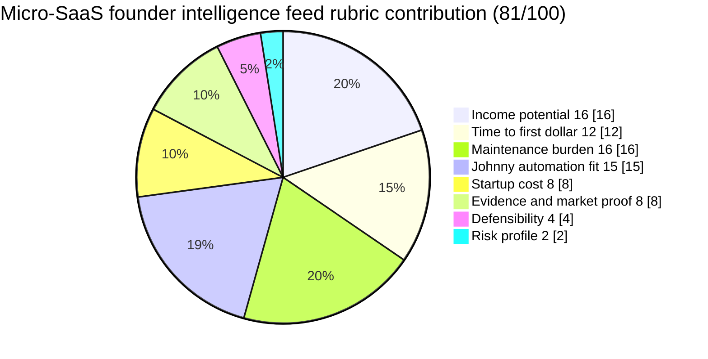

# Micro-SaaS founder intelligence feed

**One-line thesis:** Track micro-SaaS launches, pricing signals, distribution patterns, and monetization timing for indie hackers and solo founders, then sell the resulting intelligence as a recurring feed.

- Parent category: Data product
- Featured date: 2026-04-25
- Current rank: 4
- Current weighted score: 81
- Rank movement vs prior pass: held at rank 4

## Report metadata
- Date: 2026-04-25
- Opportunity name: Micro-SaaS founder intelligence feed
- Parent category: Data product
- Current rank: 4
- Current score: 81
- Prior rank: 4
- Rank movement: held
- Featured state: new contender
- Why this was featured today: This row is the highest-ranked eligible opportunity without a prior featured report. It has stayed strong near the top of the table, it has clear recurring-value mechanics, and it is a better fit for the current no-repeat featured-opportunity rule than reusing an already-covered row.
- Related inbox brief: [Idea Factory daily ranking 2026-04-25](../Daily%20Rankings/Idea%20Factory%20daily%20ranking%202026-04-25.md)
- Related run summary: [Run summary](../Research%20Runs/2026-04-25%20-%20Freshness%20and%20Micro-M%26A%20Adjacency%20Pass.md)
- Related source captures: [Source capture note, 2026-04-22](../Sources/2026-04-22%20-%20Freshness%20and%20Adjacency%20Expansion%20Pass%20Signals.md), [Source capture note, 2026-04-23](../Sources/2026-04-23%20-%20Contradiction%20and%20Drill-Down%20Pass%20Signals.md)
- Related ledger row: [Opportunity State Ledger](../../../../40%20Agent%20Nexus/Projects/Idea%20Factory/Opportunity%20State%20Ledger.md) — Micro-SaaS founder intelligence feed

## 1. Snapshot panel
- Evidence status: promising
- Johnny fit: very high
- Maintenance shape: low once the monitoring pipeline is stable
- Monetization path: subscription, premium tier, featured placement upsells
- Why it is featured today: strong unfeatured top-tier row with durable founder demand, high Johnny fit, and a clearer recurring product shape than many adjacent idea-list products

## 2. Offer
### What the product is
A recurring intelligence feed for indie hackers and solo founders that tracks micro-SaaS launches, pricing, traffic and positioning patterns, monetization timing, and category movement. The buyer is not purchasing random ideas, they are buying an operating view of where micro-SaaS demand and opportunity are actually forming.

### Who pays
- Solo founders deciding what to build next
- Indie hackers comparing niches and price bands
- Small studio teams looking for validated micro-SaaS patterns

### What they get
- Curated launch and pricing signals from active micro-SaaS products
- Pattern summaries about what is getting traction, how it is priced, and where positioning is clustering
- Filters by niche, buyer type, pricing range, and monetization model
- A recurring signal layer instead of a one-time list of ideas

### What keeps the product useful over time
Micro-SaaS markets move fast. New launches, pricing changes, copycat waves, and buyer attention shifts create ongoing demand for a maintained intelligence layer. Johnny can keep the feed useful by monitoring, deduping, summarizing, and ranking the signal flow over time.

## 3. Why now
### Demand shifts
Solo-founder and indie-hacker activity is still rising, but the challenge is no longer just building. Founders need a better read on what niches, price bands, and launch patterns are actually working.

### Trend or market signals
Earlier passes confirmed active solo-founder spending patterns and a viable $29 to $199 per month range for micro-SaaS-adjacent products. [BigIdeasDB](https://bigideasdb.com) and related validation-style products confirm founders already pay for research-backed inputs when those inputs reduce wasted build time.

### Pricing or launch signals
The strongest wedge is not generic "startup ideas." It is a maintained feed of pricing, traffic, distribution, and monetization signals that helps founders understand what kind of micro-SaaS is emerging and how those products are being sold.

### What changed recently that made this more interesting now
This row kept holding near the top without getting a full memo, while repeated features elsewhere created avoidable duplication. The better move is to feature the strongest still-uncovered top-tier row and make the product shape explicit now.

## 4. Proof and signals
### Strongest source-backed claims
- [EntrepreneurLoop](https://entrepreneurloop.com) evidence used in earlier passes confirms bootstrapped SaaS niches for solo founders are accelerating in 2026, with common price bands in the $29 to $199 per month range
- [BigIdeasDB](https://bigideasdb.com) confirms indie hackers and solo founders actively use and pay for research tools
- [IdeaProof](https://ideaproof.io) confirms sustained interest in micro-SaaS and validated opportunity surfaces

### Public market signals
- Founders are already paying for research-backed decision support
- Micro-SaaS niches are specific enough that pattern tracking is more useful than broad startup-idea brainstorming
- The product can compound through recurring refresh rather than one-off insight sales

### Contradictions or caution signals
- The feed must differentiate from generic validation tools and simple idea lists
- If the signal layer does not clearly improve decision quality, it risks collapsing into content noise
- Distribution still matters, especially if founders see the product as optional rather than workflow-critical

### Source trail
- [EntrepreneurLoop](https://entrepreneurloop.com): solo-founder SaaS pricing and profitability signals used in prior table updates
- [BigIdeasDB](https://bigideasdb.com): founder research-tool demand and micro-SaaS-adjacent market signals
- [IdeaProof](https://ideaproof.io): active validated-ideas and micro-SaaS opportunity interest
- Source capture notes: [2026-04-22](../Sources/2026-04-22%20-%20Freshness%20and%20Adjacency%20Expansion%20Pass%20Signals.md), [2026-04-23](../Sources/2026-04-23%20-%20Contradiction%20and%20Drill-Down%20Pass%20Signals.md)

## 5. Market gap
### What existing options miss
Most products either sell idea lists, validation snapshots, or broad founder content. They do not maintain a focused feed of micro-SaaS market behavior with recurring updates on pricing, demand, and positioning.

### What this opportunity does better
This row sits between generic idea databases and high-effort premium briefings. It gives founders an ongoing market read on small software opportunities, not just a static brainstorm dump.

### Wedge or defensibility angle
The wedge is sustained monitoring quality. If Johnny can keep pulling launch, pricing, and monetization signals into a cleaner recurring feed than competitors, the product becomes a maintained decision surface instead of disposable content.

## 6. Execution path
### Minimum viable offer
A starter feed tracking 25 to 50 active micro-SaaS patterns, with short notes on buyer, pricing, category motion, and monetization timing.

### Likely acquisition wedge
Indie hacker communities, founder newsletters, and build-in-public audiences where buyers are explicitly choosing what to build or how to position their next product.

### Likely first data or content loop
Johnny monitors launches, pricing pages, public traction proxies, community discussion, and category movement, then turns those into recurring ranked updates.

### Main risks that would need validation next
1. Does the buyer want a live feed, a weekly digest, or a deeper premium tier with more context?
2. Which signal types matter most to the buyer: pricing, traffic, launches, or monetization timing?
3. How much differentiation is needed to avoid looking like an idea database with better branding?

## 7. Framework fit
### Rubric pie chart

### Rubric breakdown
- Income potential: **4/5 -> 16/20**. A recurring founder-intelligence feed can support subscription and premium tiers, but it is still narrower than a larger database or enterprise-facing product.
- Time to first dollar: **4/5 -> 12/15**. A small but sharp recurring feed could be sold early as soon as the signal quality is strong enough to feel decision-useful.
- Maintenance burden: **4/5 -> 16/20**. The monitoring loop is manageable, but the feed only stays valuable if pricing, launch, and positioning signals are kept fresh.
- Johnny automation fit: **5/5 -> 15/15**. Launch tracking, pricing observation, signal summarization, and recurring synthesis are unusually strong fits for Johnny.
- Startup cost: **4/5 -> 8/10**. This can launch with lightweight tooling and strong curation, rather than a large upfront product build.
- Evidence and market proof: **4/5 -> 8/10**. Founder research-tool demand and solo-founder spending patterns are real, though the exact shape of the recurring-feed offer still needs tighter validation.
- Defensibility: **4/5 -> 4/5**. The edge comes from sustained monitoring quality and a clearer point of view than generic founder-content or idea-list products.
- Risk profile: **2/5 -> 2/5**. If the feed becomes noisy or too close to general founder content, buyers may not see it as essential enough to keep paying.
- Total weighted score: **81/100**

### Why Johnny helps materially
Johnny is unusually well-suited to the monitoring layer: collecting launch signals, spotting pricing patterns, summarizing positioning, and keeping a recurring feed updated without turning it into a labor-heavy manual research service.

### Hidden burden or fragility
If the collection logic gets noisy or the feed lacks a sharp point of view, this could degrade into just another founder-content product. The value depends on disciplined filtering and recurring signal quality.

### Why this should stay near the top, move up, move down, or split
It should stay near the top because it combines recurring value, strong founder demand, and high automation fit. It could move up if the signal mix becomes sharper and the subscription wedge looks stronger than adjacent data products. It should move down if it fails to differentiate from idea feeds or general founder newsletters. It could later split by buyer type or by signal type if one usage pattern clearly dominates.

## 8. Next move
### What the next bounded pass should try to learn
Test which dynamic source surfaces are most valuable for this row: job postings, freelance marketplaces, X, launch feeds, or pricing changes.

### What would cause promotion, demotion, split, or graduation into a downstream validation project
- Promotion: clear evidence that founders pay recurring money for a live intelligence feed rather than only one-off idea reports
- Demotion: evidence that the product is too easy to confuse with generic idea databases or founder newsletters
- Split: separate founder-facing feed and operator-facing feed if the buyer needs diverge
- Graduation: Jaret decides the row is strong enough for a dedicated validation or launch project

## Short summary for inbox pointer
Today’s featured opportunity is the micro-SaaS founder intelligence feed, a top-tier row that had stayed unfeatured despite strong position in the table. The opportunity is compelling because it sells a recurring view of what micro-SaaS products are launching, how they are priced, and where monetization is working, which fits Johnny’s monitoring and synthesis strengths unusually well.

#idea-factory #featured #micro-saas #intelligence-feed