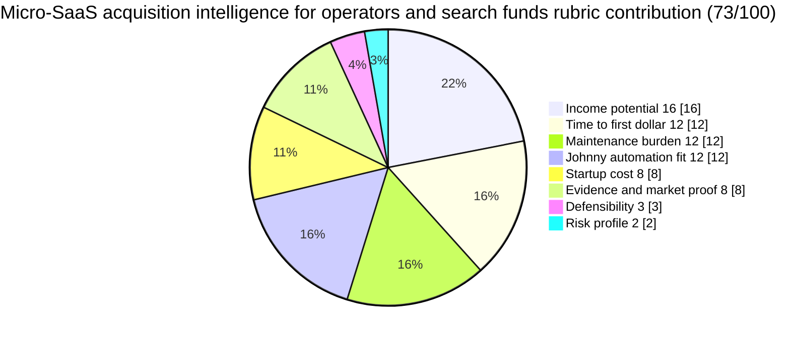

# Micro-SaaS acquisition intelligence for operators and search funds

**One-line thesis:** Monitor micro-M&A deal flow, track valuation benchmarks, and deliver acquisition readiness signals to operators and search funds assembling micro-SaaS portfolios in the sub-$5M range.

- Parent category: Data product
- Featured date: 2026-04-26
- Current rank: 9
- Current weighted score: 73
- Rank movement vs prior pass: held at rank 9

## Report metadata
- Date: 2026-04-26
- Opportunity name: Micro-SaaS acquisition intelligence for operators and search funds
- Parent category: Data product
- Current rank: 9
- Current score: 73
- Prior rank: 9
- Rank movement: held
- Featured state: new contender
- Why this was featured today: This row is the strongest eligible unfeatured top-tier row under the no-repeat feature rule (row 4 was featured yesterday). It has durable structural market confirmation with fresh Acquire.com January 2026 data, a distinct buyer persona from the already-featured row 10, and compounding potential through deal flow monitoring that fits Johnny's automation strengths unusually well.
- Related inbox brief: [Idea Factory daily ranking 2026-04-26](../Daily%20Rankings/Idea%20Factory%20daily%20ranking%202026-04-26.md)
- Related run summary: [Run summary](../Research%20Runs/2026-04-26%20-%20Contradiction%20and%20Freshness%20Pass.md)
- Related source captures: [Source capture note, 2026-04-25](../Sources/2026-04-25%20-%20Freshness%20and%20Micro-M%26A%20Adjacency%20Pass%20Signals.md), [Source capture note, 2026-04-26](../Sources/2026-04-26%20-%20Contradiction%20and%20Freshness%20Pass%20Signals.md)
- Related ledger row: [Opportunity State Ledger](../../../../40%20Agent%20Nexus/Projects/Idea%20Factory/Opportunity%20State%20Ledger.md) — Micro-SaaS acquisition intelligence for operators and search funds

## 1. Snapshot panel
- Evidence status: promising
- Johnny fit: very high
- Maintenance shape: low to medium once the monitoring and benchmarking pipeline is stable
- Monetization path: subscription, premium tier, acquisition readiness report upsells
- Why it is featured today: Strongest eligible unfeatured top-tier row under the no-repeat rule, with durable structural market confirmation and a distinct buyer persona from the already-featured row 10 (due diligence reports for individual buyers)

## 2. Offer
### What the product is
A recurring intelligence service for operators, search funds, and studio teams actively assembling micro-SaaS portfolios. The buyer gets curated deal flow monitoring, valuation benchmark updates, and acquisition readiness signals across Flippa, Acquire.com, Microns.io, and similar marketplaces — without doing raw marketplace scrolling or paying broker-level fees.

### Who pays
- Operators building micro-SaaS portfolios through search fund or operator-led acquisition structures
- Studio teams in London, Berlin, Amsterdam, and US markets that are actively acquiring profitable digital businesses in the sub-$5M range
- Individual micro-SaaS buyers who need a cleaner view of market-level deal flow beyond one-off listings

### What they get
- Curated deal flow summaries across major micro-M&A marketplaces
- Valuation benchmark updates as deals close and multiples shift
- Acquisition readiness signals: which listings look clean, priced fairly, and worth deeper DD
- A recurring intelligence layer that compounds as the market moves

### What keeps the product useful over time
The micro-M&A market moves continuously. New listings appear, pricing expectations shift as multiples change, and operators need an ongoing view of where fair deals are forming. Johnny can own the monitoring layer — watching marketplaces, updating benchmarks, flagging new opportunities — and deliver a curated intelligence feed that saves the operator hours of manual scrolling and research.

## 3. Why now
### Demand shifts
Search funds and operator-led acquisition vehicles have become a recognized structural force in the micro-M&A market. Flippa confirms active search fund activity in London, Berlin, and Amsterdam specifically. SaaS Mag confirms $3.7T in private equity dry powder seeking deployment and enterprise CIOs actively reducing vendor counts — meaning small profitable SaaS businesses are attractive acquisition targets. This creates a durable buyer persona that did not exist at this scale even two years ago.

### Trend or market signals
Acquire.com's January 2026 Biannual Acquisition Multiples Report confirms SaaS sale multiples remained stable year-over-year: in both 2024 and 2025, SaaS businesses sold at a median profit multiple of 3.9x. This stability means the market is not a passing trend but a structurally supported category with real transaction flow and buyer demand.

### Pricing or launch signals
Flippa confirms bootstrapped SaaS businesses under $1M ARR achieve average profit multiples around 2.85x, with top-quartile deals reaching 6.13x. This gives specific valuation benchmarks that operators need to assess whether a listing is fairly priced. The buyer persona is comfortable paying for intelligence that saves hours of DD work or helps them move faster on a deal.

### What changed recently that made this more interesting now
The market structure has been independently confirmed by multiple authoritative sources (Acquire.com, Flippa, SaaS Mag, startupa.ge) in 2026. The stability of median profit multiples confirms the space is not hype-driven. This row and row 10 (due diligence reports) now represent the two clearest product shapes in the micro-M&A intelligence space, with distinct buyer personas: row 10 serves individual buyers doing DIY DD, while row 9 serves operators and search funds assembling portfolios.

## 4. Proof and signals
### Strongest source-backed claims
- Acquire.com January 2026 Biannual Acquisition Multiples Report: SaaS sale multiples remained stable year-over-year at median profit multiple of 3.9x (both 2024 and 2025), confirming durable structural buyer support
- Flippa confirms bootstrapped SaaS businesses under $1M ARR achieve average profit multiples around 2.85x with top-quartile deals reaching 6.13x
- Flippa confirms search funds and operator-led acquisition vehicles (London, Berlin, Amsterdam) actively assembling portfolios of profitable digital businesses in sub-$5M range
- SaaS Mag confirms $3.7T in private equity dry powder seeking deployment and 68% of enterprise CIOs plan vendor consolidation in 2026
- startupa.ge confirms Acquire.com has $2B+ in verified buyer funds and Flippa handles $300 to $10M+ deals with active deal flow

### Public market signals
- Micro-M&A market is structurally confirmed with stable multiples and active deal flow
- Operator and search fund buyer persona is distinct from individual micro-SaaS buyer (row 10)
- No current product clearly serves the operator/search fund intelligence niche
- Valuation benchmarking is a real product need in this space

### Contradictions or caution signals
- Evidence is structural-adjacent, not yet direct-buyer-confirmed — pricing anchor still needs validation
- The operator/search fund buyer is sophisticated and may want custom intelligence rather than a standard package
- The market depends on deal flow volume — if micro-M&A activity slows, the buyer need diminishes

### Source trail
- [Acquire.com January 2026 Biannual Acquisition Multiples Report](https://blog.acquire.com/acquire-com-biannual-acquisition-multiples-report-jan-2026/): stable median profit multiples confirming market durability
- [Flippa — SaaS Mergers and Acquisitions in 2026 and Beyond](https://flippa.com/blog/the-ultimate-guide-to-saas-mergers-and-acquisitions/): bootstrapped SaaS valuation range and deal flow confirmation
- [Flippa — SaaS Valuation Multiples in 2026](https://flippa.com/blog/saas-multiples/): detailed valuation framework for micro-M&A intelligence product
- [SaaS Mag — 2026 M&A data](https://saasmag.com): PE dry powder and enterprise consolidation signals
- Source capture notes: [2026-04-25](../Sources/2026-04-25%20-%20Freshness%20and%20Micro-M%26A%20Adjacency%20Pass%20Signals.md), [2026-04-26](../Sources/2026-04-26%20-%20Contradiction%20and%20Freshness%20Pass%20Signals.md)

## 5. Market gap
### What existing options miss
Flippa, Acquire.com, and Microns.io are marketplaces — they list businesses but do not package dedicated operator-level acquisition intelligence with benchmarking, deal flow summaries, and acquisition readiness signals. Existing options serve individual buyers doing one-off deals, not operators managing a continuous acquisition pipeline.

### What this opportunity does better
This row serves the portfolio-assembling operator or search fund with a recurring intelligence layer that saves hours of manual marketplace scrolling and provides valuation context that raw listings do not offer.

### Wedge or defensibility angle
The wedge is the recurring monitoring and benchmarking layer that a marketplace cannot offer without becoming a full intelligence service. If Johnny can keep the deal flow monitoring, valuation updates, and acquisition readiness signals fresh and accurate, the product becomes a maintained intelligence surface for a buyer who is making multiple acquisitions over time.

## 6. Execution path
### Minimum viable offer
A curated weekly or biweekly micro-M&A intelligence brief covering new listings on Flippa and Acquire.com in the sub-$5M range, with valuation benchmark context, freshness signals, and acquisition readiness flags.

### Likely acquisition wedge
- Search fund and operator communities (London, Berlin, Amsterdam, US micro-SaaS studio networks)
- Micro-SaaS operator newsletters and communities where portfolio-building buyers congregate
- Direct outreach to known search funds and studio teams based on public information

### Likely first data or content loop
Johnny monitors Flippa, Acquire.com, and Microns.io for new sub-$5M listings, updates valuation benchmarks based on closed deals, and synthesizes a curated brief with acquisition readiness signals. The first loop is marketplace monitoring + benchmark updates + curation.

### Main risks that would need validation next
1. Does the operator/search fund buyer want a recurring intelligence subscription or a per-deal briefing?
2. What is the right price point for a recurring operator-level intelligence product?
3. How much deal flow monitoring does a search fund or studio team actually need versus what they do manually today?

## 7. Framework fit
### Rubric pie chart

### Rubric breakdown
- Income potential: **4/5 -> 16/20**. A recurring intelligence subscription for operators managing multiple acquisitions can support premium pricing, especially if the buyer is making multiple deals. The ticket size for a subscription can reach several hundred dollars per month given the value context.
- Time to first dollar: **4/5 -> 12/15**. A curated micro-M&A brief can be sold to an operator or search fund relatively quickly if the benchmarking quality is credible and the deal flow coverage is real.
- Maintenance burden: **3/5 -> 12/20**. The monitoring loop is manageable — tracking marketplace listings and updating benchmarks is ongoing but not prohibitively heavy. The pipeline can be mostly automated with Johnny monitoring marketplaces and synthesizing updates.
- Johnny automation fit: **4/5 -> 12/15**. Deal flow monitoring, valuation benchmark updates, and acquisition readiness signal synthesis are strong fits for Johnny's always-on monitoring and synthesis capabilities.
- Startup cost: **4/5 -> 8/10**. This can launch with Johnny monitoring marketplaces and curating a brief, without requiring a large upfront product build.
- Evidence and market proof: **4/5 -> 8/10**. Structural market is confirmed by multiple authoritative sources (Acquire.com, Flippa, SaaS Mag). The buyer persona is real and active. Still needs direct pricing anchor confirmation.
- Defensibility: **3/5 -> 3/5**. The edge comes from sustained monitoring quality and a clearer point of view on valuation benchmarks than raw marketplace listings provide. Compounding potential through deal flow history.
- Risk profile: **2/5 -> 2/5**. If the micro-M&A market slows or operator demand shifts, the buyer need changes. Market and buyer concentration risk.
- Total weighted score: **73/100**

### Why Johnny helps materially
Johnny can own the ongoing monitoring layer — watching Flippa, Acquire.com, and Microns.io for new listings, updating valuation benchmarks as deals close, and synthesizing a curated intelligence brief. This is the core of the product and Johnny's strongest automation fit in this space.

### Hidden burden or fragility
The product depends on deal flow volume. If micro-M&A activity slows significantly, the buyer need changes. The operator buyer is also sophisticated enough to validate the intelligence quality quickly, so the product must prove value early or the buyer churns.

### Why this should stay near the top, move up, move down, or split
It should stay near the top because the structural market is confirmed and the buyer persona is distinct from the already-covered row 10. It could move up if direct buyer demand signals appear or if the subscription wedge looks stronger than currently assumed. It should move down if the micro-M&A market slows or if operator buyers show they prefer custom per-deal intelligence over recurring subscriptions.

## 8. Next move
### What the next bounded pass should try to learn
Test whether operator and search fund buyers respond better to a recurring subscription model or a per-deal briefing model. Find a way to get direct buyer language from an operator or search fund buyer in a community or forum.

### What would cause promotion, demotion, split, or graduation into a downstream validation project
- Promotion: direct buyer confirmation that operators pay for recurring micro-M&A intelligence at the price point needed to support the subscription model
- Demotion: evidence that operators prefer custom per-deal intelligence or already have marketplace-level visibility
- Split: separate operator-level intelligence (row 9) from individual buyer due diligence reports (row 10) if the buyer personas prove more distinct
- Graduation: Jaret decides the row is strong enough for a dedicated validation or outreach project to operator and search fund networks

## Short summary for inbox pointer
Today's featured opportunity is the micro-SaaS acquisition intelligence feed for operators and search funds, a row that fills the gap between raw marketplace listings and expensive broker-level intelligence. The opportunity is compelling because it sells a recurring deal flow and valuation benchmarking view to buyers who are actively assembling micro-SaaS portfolios and need market-level intelligence they cannot get from a marketplace alone.

#idea-factory #featured #micro-saas #acquisition-intelligence #operators #search-funds