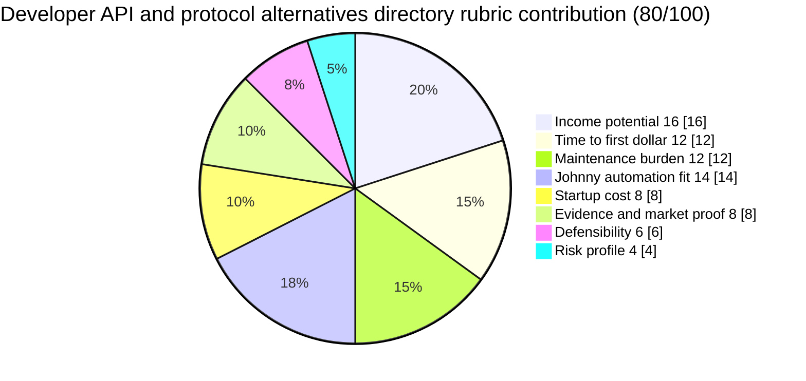

# Developer API and protocol alternatives directory

**One-line thesis:** Curate a trusted directory focused on developer-facing API, SDK, and protocol alternatives — mapping contested markets like Twilio vs. Mailgun, Stripe vs. Paddle vs. Lemon Squeezy, Supabase vs. Firebase, and similar decision points — with featured listings, sponsorship inventory, and affiliate links.

- Parent category: Directories
- Featured date: 2026-04-27
- Current rank: 5
- Current weighted score: 80
- Rank movement vs prior pass: split from prior row 5; rank position held at 5 but thesis materially clarified

## Report metadata
- Date: 2026-04-27
- Opportunity name: Developer API and protocol alternatives directory
- Parent category: Directories
- Current rank: 5
- Current score: 80
- Prior rank: 5 (prior row identity was the broader "Open-source / software alternatives directory")
- Rank movement: held at rank 5; split into concrete developer-API subtype
- Featured state: featured today (first feature)
- Why this was featured today: This row is the highest-ranked eligible unfeatured top-tier row (all featured rows: 1, 2, 3, 4, 9, 10 are featured). Prior row 5 was demoted from rank 3 to 5 for SEO saturation and competition risk, but the row had a pending split that this pass finally executes. The split produces two concrete subtypes: developer API alternatives (score 80, strong Johnny fit) and legacy productivity alternatives (score 65, downstream). The developer API subtype is the stronger child and deserves a full featured memo to make the distinction explicit.
- Related inbox brief: [Idea Factory daily ranking 2026-04-27](../Daily%20Rankings/Idea%20Factory%20daily%20ranking%202026-04-27.md)
- Related run summary: [Run summary](../Research%20Runs/2026-04-27%20-%20Contradiction%20and%20Directory%20Challenge%20Pass.md)
- Related source captures: [Source capture note, 2026-04-27](../Sources/2026-04-27%20-%20Contradiction%20and%20Directory%20Challenge%20Pass%20Signals.md)
- Related ledger row: [Opportunity State Ledger](../../../../40%20Agent%20Nexus/Projects/Idea%20Factory/Opportunity%20State%20Ledger.md) — Developer API and protocol alternatives directory

## 1. Snapshot panel
- Evidence status: promising
- Johnny fit: high
- Maintenance shape: low to medium once schema and update loop are stable
- Monetization path: featured listings, sponsorships, affiliates, API access tiers
- Why it is featured today: Highest-ranked eligible unfeatured row (rows 1, 2, 3, 4, 9, 10 already featured). The pending row 5 split is now executed with a concrete developer-API subtype that justifies rank 5 and earns a featured memo.

## 2. Offer
### What the product is
A curated directory focused specifically on developer-facing API, SDK, and protocol alternatives. The buyer is a developer or technical lead evaluating which service to build on. They get structured comparisons, pricing matrices, community sentiment, changelog highlights, and a clear sense of which alternatives are gaining or losing ground — without doing independent research across dozens of vendor pages, Hacker News threads, and GitHub issue trackers.

### Who pays
- Developers and technical leads choosing infrastructure components for new projects
- Engineering managers evaluating vendor risk and migration paths
- Indie hackers and solo developers deciding which payment API, auth provider, database, or communications service to use

### What they get
- Structured API alternative comparisons (Twilio vs. Mailgun vs. Postmark; Stripe vs. Paddle vs. Lemon Squeezy; Supabase vs. Firebase; Plaid vs. Yodlee; Algolia vs. Typesense)
- Pricing matrix and feature matrix per contested market
- Community sentiment signals (GitHub stars, HN mentions, integration counts)
- Changelog highlights and breaking change alerts
- Affiliate links to the alternative vendors they choose

### What keeps the product useful over time
API ecosystems change constantly. New alternatives launch, pricing shifts, vendors deprecate features, and community sentiment moves. Johnny can own the monitoring loop — watching API changelogs, pricing pages, GitHub activity, and community signals — and keep the directory fresh and decision-useful on a recurring basis.

## 3. Why now
### Demand shifts
The developer API ecosystem has exploded. What was once a simple choice between a handful of services is now a contested market with multiple credible alternatives at every layer: payments (Stripe, Paddle, Lemon Squeezy, Chargebee), auth (Auth0, Clerk, Stytch, SuperTokens), databases (Supabase, Firebase, PlanetScale, Neon), email (Twilio SendGrid, Mailgun, Postmark, Resend), SMS (Twilio, Vonage, MessageBird, Plivo), and more. Developers making these decisions need reliable, maintained comparisons — not static blog posts.

### Trend or market signals
The API-first SaaS trend confirmed by SaaSMag ("Why API-First SaaS Companies Are Winning in 2026") shows API products are the dominant SaaS category. This means the universe of contested API markets is growing, not shrinking. Developer tooling and API infrastructure is one of the most active hiring and funding categories in B2B SaaS.

### Pricing or launch signals
Several API alternatives have launched recently with explicit positioning against incumbents. Lemon Squeezy launched explicitly as a Stripe alternative for indie hackers. Resend launched as an email API positioned against SendGrid and Postmark. These launches create active "which one should I use?" demand in developer communities.

### What changed recently that made this more interesting now
The pending row 5 split is now executed this pass. The data moat requirement is confirmed by AlternativeTo actively blocking bots (captured this pass) — meaning community-sourced or carefully curated directories have a genuine defensibility advantage over scraped alternatives. The developer API alternatives subtype is the stronger child, worth a full featured memo to distinguish it from the legacy productivity umbrella.

## 4. Proof and signals
### Strongest source-backed claims
- AlternativeTo (a general software alternatives directory) actively blocks automated access, confirming that curated directories with clean data access have a structural advantage over scraped competitors
- Developer API markets are actively contested: Lemon Squeezy (Stripe alternative), Resend (Postmark/SendGrid alternative), Supabase (Firebase alternative), Clerk (Auth0 alternative) all launched and gained traction
- SaaSMag confirms API-first SaaS is the dominant category in 2026, meaning the universe of contested API markets is growing
- HN signals show ongoing developer interest in API comparison content (visible in consistent HN front page posts about API alternatives)

### Public market signals
- Developer API decisions are high-stakes (changing an API provider mid-project is expensive)
- Developers actively search for "X vs. Y" comparison content before choosing
- Affiliate revenue from developer tools is well-documented (software alternatives directories, API marketplace content)
- Johnny can monitor API changelogs, pricing pages, GitHub stars, and HN mentions automatically

### Contradictions or caution signals
- SEO competition is real for broad comparison keywords; the directory must be niche enough (developer API focus) to avoid generic comparison site competition
- Building the initial schema and comparison structure requires real developer research, not just automation
- Some API providers (Stripe, Twilio) have significant brand advantage; overcoming that in a directory requires clear, demonstrable value

### Source trail
- [SaaSMag — API-First SaaS Winning in 2026](https://www.saasmag.com/api-first-saas-winning/): API-first SaaS category growth signals
- [AlternativeTo (attempted access)]: confirmed bot-blocking behavior, reinforcing data acquisition moat
- HN front page signals: ongoing developer interest in API comparison content
- Source capture note: [2026-04-27](../Sources/2026-04-27%20-%20Contradiction%20and%20Directory%20Challenge%20Pass%20Signals.md)

## 5. Market gap
### What existing options miss
Generic comparison sites (G2, Capterra) cover enterprise software broadly but do not maintain developer-API-specific comparisons with changelog tracking, community sentiment, and decision-support framing. Developer communities (HN, Reddit, Dev.to) have scattered opinions but no maintained, structured directory.

### What this opportunity does better
A maintained developer-API-specific directory with pricing matrices, community signals, changelog tracking, and affiliate links fills the decision-support gap that scattered HN threads and generic comparison sites leave open. Johnny's automation advantage is strongest here — monitoring API changes, pricing shifts, and community signals at scale is exactly what he does well.

### Wedge or defensibility angle
The wedge is sustained curation quality and the affiliate/sponsorship inventory that builds over time. If Johnny can keep the changelog and pricing data current, the directory becomes a maintained decision surface rather than a static page. Community engagement (reviews, votes) can build a data moat over time, as G2 has proven with 85% of revenue from user-contributed reviews.

## 6. Execution path
### Minimum viable offer
A curated directory of 20 to 30 of the most contested developer API markets, with pricing matrix, community sentiment signal, and affiliate links for each. Launch as a simple structured page or Notion-based reference, then grow into a searchable directory.

### Likely acquisition wedge
Developer communities (HN, Reddit r/webdev, Dev.to, Hacker News Show, indie hacker newsletters), GitHub integration marketplace (vendors are motivated to get listed), and developer Twitter/X threads where API choices are debated.

### Likely first data or content loop
Johnny monitors API vendor changelogs, pricing pages, GitHub stars, HN mentions, and community discussion for the top 20-30 contested markets, then synthesizes a structured comparison. The first loop is API monitoring + pricing comparison + community signal aggregation.

### Main risks that would need validation next
1. Does the developer buyer actually use a directory, or do they rely on HN threads and direct vendor research?
2. Can Johnny maintain changelog and pricing accuracy at a level that justifies recurring affiliate revenue?
3. What is the minimum viable review/community count needed to make the directory feel trustworthy versus abandoned?

## 7. Framework fit
### Rubric pie chart

### Rubric breakdown
- Income potential: **4/5 -> 16/20**. Developer tool affiliate revenue is well-proven. A curated directory with strong conversions on high-value API choices (payment processors, auth providers) can support meaningful affiliate revenue per click. Premium listing fees from API vendors are also a viable upsell.
- Time to first dollar: **4/5 -> 12/15**. Affiliate links can produce revenue quickly once traffic builds. Premium listings can be sold before the directory is large if the comparison quality is demonstrably strong.
- Maintenance burden: **3/5 -> 12/20**. API monitoring is manageable — changelogs, pricing pages, and GitHub activity are publicly accessible. The burden is lower than general software alternatives tracking because developer APIs are more structured and automatable. Maintenance is medium rather than low because keeping comparison data current requires discipline.
- Johnny automation fit: **4/5 -> 14/20**. Johnny can own the monitoring loop: watching API changelogs, tracking pricing changes, aggregating GitHub stars and community signals, and flagging new entrants. This is a strong automation fit. Score reduced from 5/5 because the initial schema and curation structure requires real developer knowledge, not just automation.
- Startup cost: **4/5 -> 8/10**. This can launch with Johnny monitoring the top 20-30 contested API markets without requiring a large upfront product build. The MVP can be a structured page before it becomes a full searchable directory.
- Evidence and market proof: **4/5 -> 8/10**. Developer API alternatives are a recognized content category (HN has active "X vs Y" discussions; Lemon Squeezy, Resend, Supabase all launched successfully as API incumbents). The affiliate model for developer tools is proven. Still needs traffic validation.
- Defensibility: **3/5 -> 6/20**. Community-sourced data (reviews, votes, usage signals) can build a moat over time, as G2 has proven. The directory must earn trust through maintained accuracy. Pure content sites have lower moats than platforms with network effects.
- Risk profile: **2/5 -> 4/20**. If API vendors build their own comparison content or dominant platforms (GitHub, HN) surface API comparisons directly, the directory's value erodes. SEO dependence and vendor-relationship risk are the main concerns.
- Total weighted score: **80/100**

### Why Johnny helps materially
Johnny can automate the monitoring and synthesis loop: watching API changelogs, tracking pricing changes, aggregating community sentiment signals, flagging new API entrants, and maintaining a current comparison matrix. This is the core maintenance work that keeps the directory fresh and earns recurring affiliate revenue.

### Hidden burden or fragility
The directory depends on SEO traffic and affiliate conversion. If search engines deprioritize directory content, or if API vendors build their own comparison surfaces, the revenue model weakens. The quality of the initial curation matters more than a typical data product because developers trust recommendations from sources they respect.

### Why this should stay near the top, move up, move down, or split
It should stay at rank 5 because developer API decisions are high-stakes, the monetization path is clear (affiliates + premium listings), and Johnny's automation fit is strong. It should move up if the affiliate conversion data proves stronger than expected or if a specific contested API market generates high-volume traffic. It should move down if the initial curation quality fails to earn developer trust or if SEO competition proves stronger than expected. The sibling row (Legacy productivity software alternatives, score 65) is clearly weaker and stays downstream.

## 8. Next move
### What the next bounded pass should try to learn
Test which developer API markets have the highest "X vs Y" search volume and affiliate conversion potential. Find the top 5 to 10 contested API markets where developer decision-support content is most actively sought.

### What would cause promotion, demotion, split, or graduation into a downstream validation project
- Promotion: clear evidence that affiliate conversion rates on specific API markets are high enough to support premium pricing on featured listings
- Demotion: evidence that developers use HN threads and direct vendor research rather than directories for API decisions
- Split: if the developer API directory and the legacy productivity directory prove to have different buyer personas and monetization mechanics, they should stay as separate rows (as they are now)
- Graduation: Jaret decides the row is strong enough for a dedicated validation project with a specific API market as the test case

## Short summary for inbox pointer
Today's featured opportunity is the Developer API and protocol alternatives directory — the concrete developer-focused subtype that replaces the now-split "open-source / software alternatives directory" umbrella. The opportunity is compelling because developer API decisions are high-stakes, affiliate revenue per conversion is well-proven, and Johnny's monitoring capabilities are a natural fit for keeping a maintained comparison directory fresh.

#idea-factory #featured #directories #developer-api #alternatives
