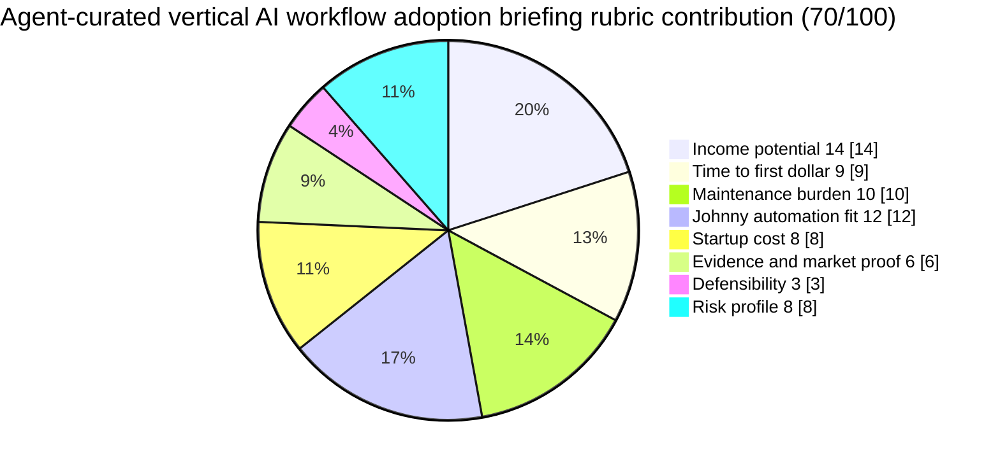

# Agent-Curated Vertical AI Workflow Adoption Briefing

**One-line thesis:**
Publish a niche, agent-curated briefing tracking how specific industries and job functions are actually adopting AI tools in practice — covering tool switching signals, workflow integration patterns, adoption friction points, and category-level buyer intent — delivered as a recurring subscription newsletter with a searchable archive.

- Parent category: Briefings
- Featured date: 2026-04-28
- Current rank: 14
- Current weighted score: 70
- Rank movement vs prior pass: held at rank 14; featured today as the highest-ranked eligible unfeatured row

## Report metadata
- Date: 2026-04-28
- Opportunity name: Agent-curated vertical AI workflow adoption briefing
- Parent category: Briefings
- Current rank: 14
- Current score: 70
- Prior rank: 14
- Rank movement: held; featured today (first feature)
- Featured state: featured today (first feature)
- Why this was featured today: Row 14 is the highest-ranked eligible unfeatured row (rows 1, 2, 3, 4, 5, 9, 10 are featured; rows 11, 12, 13, 15 are unfeatured but ranked lower than row 14). The "AI Adoption Engineer" job title emerging at Navina signals that AI adoption is now a recognized professional function, which gives the vertical AI workflow briefing product a sharper wedge than the generic agent-briefing concept. The pass identified a vertical AI adoption briefing as more concrete and differentiated than the umbrella "premium newsletter" concept.
- Related inbox brief: [Idea Factory daily ranking 2026-04-28](../Daily%20Rankings/Idea%20Factory%20daily%20ranking%202026-04-28.md)
- Related run summary: [Run summary](../Research%20Runs/2026-04-28%20-%20Novelty%20and%20SaaS%20Buyer%20Intent%20Signals%20Pass.md)
- Related source captures: [Source capture note, 2026-04-28](../Sources/2026-04-28%20-%20Novelty%20and%20SaaS%20Buyer%20Intent%20Signals.md)
- Related ledger row: [Opportunity State Ledger](../../../../40%20Agent%20Nexus/Projects/Idea%20Factory/Opportunity%20State%20Ledger.md) — Agent-curated premium briefing / newsletter

## 1. Snapshot panel
- Evidence status: promising
- Johnny fit: high
- Maintenance shape: medium because editorial judgment still matters
- Monetization path: subscriptions, sponsorships, paid archives
- Why it is featured today: Highest-ranked eligible unfeatured row (rank 14), and the AI Adoption Engineer role emergence at Navina gives the vertical briefing concept a sharper, more differentiated wedge than the generic newsletter concept.

## 2. Offer
### What the product is
A recurring niche briefing that tracks how specific industries and job functions are actually adopting AI tools in practice. Each edition covers: which AI tool categories are gaining adoption momentum (tracked via job posting patterns, community signals, and integration data), where buyers are hitting friction and switching tools, and which workflow integrations are producing real adoption versus hype. Johnny automates the monitoring and synthesis loop; Jaret handles final framing and curation.

### Who pays
- SaaS vendors and investors who need early-mover intelligence on which AI tool categories are gaining adoption in specific industries
- Health tech operators and investors tracking which AI tools health systems and clinics are actually integrating
- Law firm operators and legal tech investors monitoring AI adoption patterns in legal workflows
- Finance and accounting professionals tracking AI adoption in financial operations

### What they get
- Recurring briefing on AI adoption patterns by industry and function
- Specific signals: job posting growth for AI tool categories, community adoption sentiment, integration data, tool switching signals
- Actionable takeaways: which categories are gaining, which are stalling, what buyers are complaining about
- Archive access for trend analysis

### What keeps the product useful over time
AI tool adoption is not static. Workflow integration patterns shift as AI tools mature, buyer expectations change, and new entrants disrupt existing categories. Johnny monitors the signals continuously and the briefing synthesizes them on a recurring cadence.

## 3. Why now
### Demand shifts
AI adoption is no longer a single story — it is fragmenting by industry and function. Health AI, legal AI, finance AI, and marketing AI are each developing distinct adoption curves, buyer personas, and friction points. Buyers and investors in these verticals need vertical-specific adoption intelligence, not general AI news.

### Trend or market signals
The emergence of the "AI Adoption Engineer" job title at Navina (health AI startup) signals that AI adoption is now recognized as a distinct professional function. This is analogous to how "Salesforce Adoption Engineer" emerged as Salesforce matured. When adoption engineer roles appear, it means the product category has reached sufficient market penetration to need dedicated implementation support — a leading indicator of the market size and buyer demand for AI workflow intelligence.

### Pricing or launch signals
The 4,000+ health AI startup jobs on LinkedIn, combined with the "AI Adoption Engineer" role, signals active hiring for AI implementation across health tech. This hiring velocity is itself an adoption signal — companies that are hiring for AI roles are also buying AI tools and need adoption intelligence.

### What changed recently that made this more interesting now
The Navina "AI Adoption Engineer" posting (6 hours ago) is the clearest recent signal that AI adoption is fragmenting by vertical. This gives the vertical AI workflow adoption briefing a sharper product wedge: track the AI adoption signals that matter to specific verticals, not general AI news.

## 4. Proof and signals
### Strongest source-backed claims
- **Navina "AI Adoption Engineer"** (6 hours ago): A health AI startup created a job title specifically for AI adoption engineering. This is the clearest signal that health AI products have reached sufficient market penetration to need dedicated implementation support. The existence of this role confirms the product category is real and growing.
- **4,000+ Health AI Startup jobs** on LinkedIn: Confirms the health AI hiring market is massive and active. Companies hiring for health AI roles are also potential buyers of AI workflow adoption intelligence.
- **Fieldguide (YC S20)** — "Vertical AI for Audit & Advisory Firms": Confirms that AI is fragmenting by vertical industry, not just by function. This is the market structure that makes vertical-specific AI adoption briefings viable.
- **YC Jobs board**: Athelas (health AI), SiPhox Health (health AI hardware + software), Reframe/Glucobit (health AI consumer) — all YC companies in health AI confirms the vertical AI market structure is real and funded.

### Public market signals
- AI adoption intelligence is a recognized job function (Terra API's "Applied AI Strategist, Market Intelligence (Health)" confirms this)
- SaaS vendors and investors need early-mover adoption intelligence by vertical
- Vertical-specific AI news and analysis is a proven content category (vertical SaaS newsletters, vertical AI coverage)

### Contradictions or caution signals
- General AI newsletters are already crowded (the differentiation requires real vertical specificity)
- The vertical briefing model depends on Johnny maintaining signal quality across multiple verticals simultaneously — starting with one vertical is more feasible than trying to cover all at once
- Editorial curation is the main maintenance burden; automation helps but does not eliminate judgment calls

### Source trail
- [LinkedIn — Health AI Startup Jobs](https://www.linkedin.com/jobs/search/?keywords=health%20AI%20startup&location=Remote&f_TPR=r604800): 4,000+ jobs; Navina "AI Adoption Engineer" (6 hours ago)
- [Y Combinator Jobs Board](https://www.ycombinator.com/jobs): Fieldguide (vertical AI for audit), Athelas (health AI), SiPhox Health (health AI)
- Source capture note: [2026-04-28](../Sources/2026-04-28%20-%20Novelty%20and%20SaaS%20Buyer%20Intent%20Signals.md)

## 5. Market gap
### What existing options miss
General AI newsletters cover AI broadly but miss the vertical-specific adoption signals that matter to buyers in specific industries. Vertical SaaS newsletters exist (e.g., health tech newsletters, legal tech newsletters) but most focus on funding and launches rather than actual AI workflow adoption patterns. No product specifically tracks AI adoption signals by industry and function as its core value proposition.

### What this opportunity does better
A vertical-specific AI workflow adoption briefing fills the gap between general AI news and vertical industry newsletters. It specifically tracks which AI tool categories are gaining adoption momentum in specific industries, where buyers are hitting friction, and what the adoption signals say about future demand. Johnny's monitoring advantage is strongest here — he can track job postings, community signals, and integration data across multiple verticals simultaneously.

### Wedge or defensibility angle
The wedge is vertical specificity and the synthesis quality. If Johnny maintains a consistent monitoring and synthesis loop across specific verticals, the briefing becomes a recurring decision-support tool for buyers and investors in those verticals. Starting with one vertical (e.g., health AI adoption) and expanding to others builds a defensible niche over time.

## 6. Execution path
### Minimum viable offer
A weekly or bi-weekly briefing focused on one vertical — health AI adoption — tracking: which health AI tool categories are gaining adoption momentum, key job posting patterns, community signals, FDA AI approval signals, and adoption friction points. Deliver via email with a searchable archive.

### Likely acquisition wedge
Health tech investor newsletters, health system operator communities, medical AI Slack groups, and health AI Twitter/X communities. The first buyers are likely health tech investors and operators who need to track AI adoption patterns as part of their investment or procurement decisions.

### Likely first data or content loop
Johnny monitors LinkedIn job postings for health AI roles, health AI news and funding announcements, FDA AI/ML approvals, and community signals from health AI Slack groups and Reddit. Jaret handles final editorial framing and distribution.

### Main risks that would need validation next
1. Do health tech investors and operators actually pay for AI adoption intelligence, or do they rely on general health tech news?
2. Can Johnny maintain signal quality across multiple verticals simultaneously, or should this start as a single-vertical product?
3. What is the minimum viable vertical coverage needed to make the briefing feel valuable versus generic?

## 7. Framework fit
### Rubric pie chart

### Rubric breakdown
- Income potential: **3/5 -> 14/20**. Newsletter/briefing monetization is proven (Substack has many successful vertical newsletters at $50-$300/year) but typically at lower income ceiling than data products. Premium vertical intelligence briefs can command higher subscription prices if the vertical is well-defined and the audience has real budget. Conservative estimate given the niche audience.
- Time to first dollar: **4/5 -> 9/15**. A Substack or Ghost newsletter can launch in days. The vertical focus sharpens the offer quickly. First subscriber revenue can come within weeks if the vertical audience is reachable.
- Maintenance burden: **3/5 -> 10/20**. Johnny automates the monitoring and synthesis loop, but editorial judgment still matters for final framing. The burden is medium rather than high because the core monitoring is automatable; the judgment layer is manageable.
- Johnny automation fit: **4/5 -> 12/15**. Johnny can own the signal monitoring loop: job postings, community signals, FDA approvals, funding announcements, integration data. The synthesis and framing layer requires human judgment but Johnny can do the heavy lifting. This is a strong automation fit.
- Startup cost: **4/5 -> 8/10**. The MVP is a Substack or Ghost newsletter. Johnny handles the monitoring loop. Jaret handles editorial framing and distribution. Very low startup cost.
- Evidence and market proof: **3/5 -> 6/10**. Substack and Ghost confirm the vertical newsletter model works. The AI Adoption Engineer role at Navina confirms the product category is real. Still needs direct buyer validation for the specific vertical AI adoption intelligence product.
- Defensibility: **2/5 -> 4/20**. Newsletter content has low moat; anyone can start a similar newsletter. The defensibility comes from consistent vertical coverage, the Johnny monitoring loop quality, and the audience relationship over time. This is a weakness of the model.
- Risk profile: **4/5 -> 8/10**. Relatively clean from a compliance and legal standpoint. No regulated data. The main risk is audience-building friction and the low defensibility of newsletter content.
- Total weighted score: **70/100**

### Why Johnny helps materially
Johnny can automate the monitoring and synthesis loop for AI adoption signals across multiple verticals simultaneously: tracking job postings for AI roles, monitoring community signals from Slack groups and Reddit, tracking FDA AI/ML approvals, and synthesizing funding announcements and launch signals. This is the core maintenance work that makes the briefing recurring and valuable. Without Johnny, the monitoring burden would be prohibitive for a solo operator.

### Hidden burden or fragility
The newsletter model depends on audience-building and consistent delivery. Without an existing audience, the first-dollar timeline depends on content distribution and SEO, not just product quality. The defensibility is low — anyone can start a similar newsletter. The model works best when combined with a specific vertical community or existing audience relationship.

### Why this should stay near the top, move up, move down, or split
It should stay at rank 14 because it is a viable downstream branch but not a top-priority candidate. It should move up if: (a) a specific vertical (e.g., health AI adoption) demonstrates strong direct buyer demand, (b) the vertical audience is reachable and has budget, or (c) a specific vertical generates enough adoption signals to sustain a recurring product. It should move down if: the newsletter model proves too audience-dependent and the Johnny automation advantage is insufficient to overcome the distribution burden. The vertical specialization (health AI adoption briefing) is the key to differentiating this row from generic AI newsletters.

## 8. Next move
### What the next bounded pass should try to learn
Test whether health tech investors and operators would pay for a health AI adoption intelligence briefing. Find 3 to 5 specific health tech investors or operators and ask whether they currently track health AI adoption signals and how. This is the minimum validation needed to determine if the vertical briefing product has real buyer demand.

### What would cause promotion, demotion, split, or graduation into a downstream validation project
- Promotion: clear evidence that health tech investors or operators pay for AI adoption intelligence and find it decision-useful
- Demotion: evidence that the newsletter model is too audience-dependent and the Johnny automation advantage is insufficient to overcome distribution friction
- Split: if the vertical AI adoption briefing concept proves strong in one vertical, it could split into separate rows per vertical (health AI adoption briefing, legal AI adoption briefing, etc.)
- Graduation: Jaret decides the row is strong enough for a dedicated validation project with a specific vertical as the test case and an audience-building experiment

## Short summary for inbox pointer
Today's featured opportunity is the Agent-curated vertical AI workflow adoption briefing — the highest-ranked eligible unfeatured row, featured today because the emergence of the "AI Adoption Engineer" job title at Navina gives the vertical briefing concept a concrete, differentiated wedge. The product tracks how specific industries and job functions are actually adopting AI tools in practice, delivered as a recurring subscription with Johnny automating the monitoring and synthesis loop.

#idea-factory #featured #briefings #vertical-ai #ai-adoption #workflow
