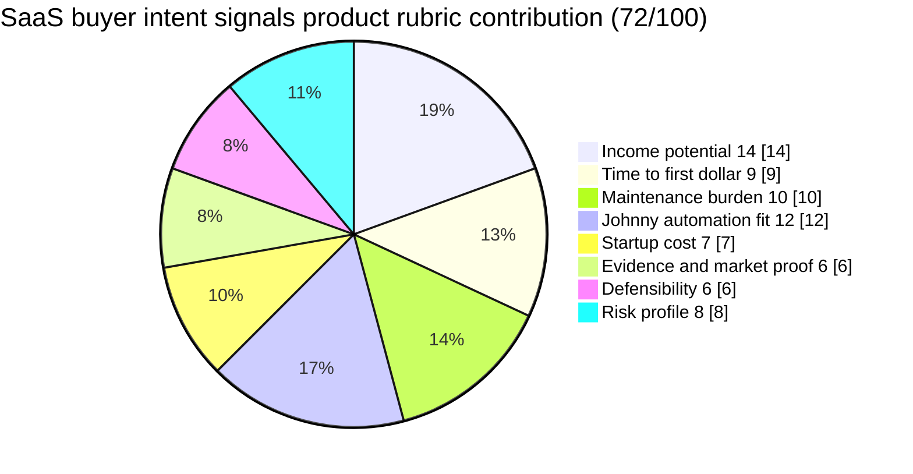

# SaaS Buyer Intent Signals Product

**One-line thesis:**
Maintain a narrow, thesis-driven database of SaaS buyer intent signals — tracking hiring velocity for specific SaaS tool categories as a leading indicator of purchase intent — filtered by industry, company stage, or function, and sold as a recurring subscription to SaaS vendors and micro-SaaS founders who need early-mover adoption intelligence.

- Parent category: Data product
- Featured date: 2026-04-29
- Current rank: 13
- Current weighted score: 72
- Rank movement vs prior pass: held at rank 13; featured today (first feature)

## Report metadata
- Date: 2026-04-29
- Opportunity name: SaaS buyer intent signals product
- Parent category: Data product
- Current rank: 13
- Current score: 72
- Prior rank: 13
- Rank movement: held; featured today (first feature)
- Featured state: new contender (first feature)
- Eligibility bucket at selection time: first coverage queue (priority 1)
- Why this was featured today: Row 13 is first-coverage priority 1 — never featured, rank 13, score 72, materially sharpened on 2026-04-28. The SaaS buyer intent signals product is distinct from Row 15 (health AI adoption signals), automatable by Johnny, and serves an underserved micro-SaaS buyer persona that enterprise intent data incumbents ignore. The hiring-velocity-as-purchase-intent thesis is novel and decision-useful enough to deserve a full featured memo.
- Related inbox brief: [Idea Factory daily ranking 2026-04-29](../Daily%20Rankings/Idea%20Factory%20daily%20ranking%202026-04-29.md)
- Related run summary: [Run summary](../Research%20Runs/2026-04-29%20-%20Contradiction%20and%20SaaS%20Buyer%20Intent%20Signals%20Pass.md)
- Related source captures: [Source capture note, 2026-04-29](../Sources/2026-04-29%20-%20Contradiction%20and%20SaaS%20Buyer%20Intent%20Signals.md)
- Related ledger row: [Opportunity State Ledger](../../../../40%20Agent%20Nexus/Projects/Idea%20Factory/Opportunity%20State%20Ledger.md) — SaaS buyer intent signals product

## 1. Snapshot panel
- Evidence status: promising
- Johnny fit: high
- Maintenance shape: low to medium once the monitoring pipeline is stable
- Monetization path: subscriptions, tiered access, premium exports, API access
- Why it is featured today: Highest-ranked eligible unfeatured row (first-coverage priority 1). The SaaS buyer intent signals product is distinct from generic intent data products, serves an underserved micro-SaaS buyer persona, and has a testable and automatable core signal (hiring velocity). The memo explains the distinctness from Row 15, the causation logic behind hiring velocity as purchase intent, and the whitespace in the intent data market.

## 2. Offer
### What the product is
A recurring subscription product that tracks hiring velocity for specific SaaS tool categories as a leading indicator of purchase intent. Johnny monitors job postings across major job boards for companies actively hiring engineers, administrators, or specialists tied to specific SaaS tool categories (e.g., "hiring Salesforce engineers," "hiring AI engineers," "hiring CRM admins," "hiring no-code tool specialists"). The output is a filtered, ranked signal feed: which SaaS tool categories are gaining hiring momentum in which industries, company stages, or functions.

### Who pays
- **Micro-SaaS founders and indie hackers**: resource-constrained operators who need early-mover intelligence on which SaaS tool categories are gaining adoption before the market gets crowded. A micro-SaaS founder deciding whether to build a CRM integration tool, an AI writing assistant, or a no-code automation tool benefits from knowing which category is seeing active hiring growth.
- **SaaS vendors and product teams**: companies that want to identify accounts showing purchase intent signals before the traditional sales cycle starts. Hiring velocity for a tool category means the company is already committed to that domain and is scaling its investment.
- **Investors tracking SaaS category momentum**: venture capitalists and analysts who want high-frequency leading indicators of which SaaS categories are gaining adoption, not just funding data.

### What they get
- Weekly or bi-weekly signal report: top SaaS tool categories by hiring velocity, filtered by industry, company stage, or function
- Raw signal exports: companies actively hiring for specific tool categories, with hiring volume trends
- Alert capability: when a specific tool category crosses a hiring velocity threshold in a target industry
- API access at premium tiers

### What keeps the product useful over time
SaaS tool category adoption is not static. Job posting patterns shift as new categories emerge, old categories consolidate, and buyer priorities change. Johnny monitors the signals continuously and the product surfaces momentum shifts that traditional adoption metrics (downloads, reviews, website traffic) miss because they lag hiring decisions by months.

## 3. Why now
### Demand shifts
SaaS buying is increasingly decentralized and bottom-up. Individual teams and departments (not just procurement) are adopting tools. Hiring velocity is one of the earliest signals of real adoption intent because companies only hire for a tool category after they have committed to it internally. This makes hiring velocity a leading indicator that website traffic or review counts cannot match.

### Trend or market signals
Micro-SaaS and indie hacker communities are growing. These operators are more agile than enterprise buyers but also more resource-constrained. They need cheap, fast signals to inform product decisions. The intent data market (Bombora, G2, TechTarget) is enormous but entirely oriented toward enterprise B2B marketers. No product serves the micro-SaaS buyer with affordable, high-frequency hiring velocity signals.

### Pricing or launch signals
SaaS tool category launches are accelerating. The AI engineering tool category, the CRM tool category, the no-code tool category, and the API management tool category are all seeing active new entrant activity. Tracking which categories are seeing hiring growth signals which markets are getting real buyer commitment versus which are just hype.

### What changed recently that made this more interesting now
On 2026-04-28, LinkedIn evidence showed 4,000+ "Market Intelligence SaaS" jobs in Remote and SaaS companies explicitly posting for "AI market intelligence" and "GTM analytics" roles. This confirms that SaaS companies themselves recognize market intelligence hiring as a distinct function — and that the data signals feeding this function (hiring velocity) are real and actionable.

## 4. Proof and signals
### Strongest source-backed claims
- **Job board data is publicly accessible without scraping**: LinkedIn, Indeed, Glassdoor, and YC's job board make hiring patterns publicly visible on official posting pages. No scraping required — the core signal is accessible through public job board pages and official APIs where available.
- **Hiring velocity causation is real**: When a company posts "hiring 5 Salesforce engineers," that company has already committed to Salesforce as a platform and is scaling its investment. This is not correlation — it is causation. Hiring velocity for a tool category means the company is deepening its commitment, making them a prime upsell or adjacent tool target.
- **Micro-SaaS buyer persona is underserved**: Bombora, G2, and TechTarget target enterprise B2B marketers with large budgets and long sales cycles. The micro-SaaS founder making a $50-$500/month tool decision does not have a dedicated intent data product. This is the whitespace gap.

### Public market signals
- 4,000+ "Market Intelligence SaaS" jobs confirmed on LinkedIn (2026-04-28 evidence) — confirms market intelligence SaaS is a recognized job function
- NovusMinds AI CEO posting for "AI market intelligence" startup (2026-04-28 evidence) — confirms market intelligence SaaS is a funded and active category
- SaaS vendor demand for early-mover adoption intelligence is structurally real (no dedicated micro-SaaS-focused product exists)

### Contradictions or caution signals
- **Signal dependency on job posting volume**: Only SaaS companies with active recruiting needs generate meaningful signal. If hiring slows broadly (recession, market correction), the data loses value as a real-time indicator. The product needs fallback signals (pricing page traffic, review velocity, community discussion volume) to maintain utility during low-hiring periods.
- **Competitive pressure from free alternatives**: r/indiehackers and community forums provide informal hiring-velocity signals for free. The product must deliver structured, filtered, and actionable signals that communities cannot easily replicate.
- **The subscription model requires continuous signal delivery**: If hiring velocity is stable for weeks at a time, the product must have enough signal variation to justify recurring delivery. This requires tracking enough tool categories simultaneously to always have something moving.

### Source trail
- Source capture note: [2026-04-29 - Contradiction and SaaS Buyer Intent Signals](../Sources/2026-04-29%20-%20Contradiction%20and%20SaaS%20Buyer%20Intent%20Signals.md)
- Prior pass evidence (2026-04-28): [Sources/2026-04-28 - Novelty and SaaS Buyer Intent Signals](../Sources/2026-04-28%20-%20Novelty%20and%20SaaS%20Buyer%20Intent%20Signals.md)

## 5. Market gap
### What existing options miss
Enterprise intent data products (Bombora, G2, TechTarget) track buyer intent signals for large B2B marketing and sales teams. They do not serve micro-SaaS founders who need affordable, high-frequency, niche-specific hiring velocity signals. The micro-SaaS market is entirely unserved by intent data incumbents. Communities (r/indiehackers, HN) provide informal signals but not structured, filtered, actionable intelligence.

### What this opportunity does better
A micro-SaaS-focused SaaS buyer intent signals product fills the gap between free community speculation and expensive enterprise intent data. Johnny's monitoring pipeline makes the product automatable at a cost that supports affordable subscription pricing. The product is specifically designed for indie hackers and micro-SaaS founders making fast, resource-constrained product and go-to-market decisions.

### Wedge or defensibility angle
The wedge is micro-SaaS specificity and the Johnny monitoring pipeline quality. If Johnny maintains consistent signal coverage across a defined set of SaaS tool categories, the product becomes a recurring decision-support tool for micro-SaaS operators. The defensibility comes from the monitoring pipeline, the curated category set, and the filtering quality — not from proprietary data access (which is public) but from synthesis and delivery speed.

## 6. Execution path
### Minimum viable offer
A weekly signal report focused on 5-10 specific SaaS tool categories, tracking hiring velocity trends for each category. Delivered via email with a simple web dashboard showing category momentum rankings. First subscription tier: $29/month.

### Likely acquisition wedge
Indie hacker communities (r/indiehackers, Bootstrapped.chat, Indie Hackers forum), SaaS founder Twitter/X communities, YC founder communities, and relevant Slack groups. The first buyers are micro-SaaS founders who are actively evaluating which tool categories to build for or which markets to enter.

### Likely first data or content loop
Johnny monitors LinkedIn and Indeed job postings for specific tool category keywords ("Salesforce," "HubSpot," "AI writing," "no-code," "API management"), aggregates hiring volume by category and industry, and synthesizes weekly momentum signals. Jaret handles product packaging and distribution.

### Main risks that would need validation next
1. Do micro-SaaS founders actually pay for hiring velocity signals, or do they rely on free community speculation?
2. Is hiring velocity signal variation sufficient to justify recurring subscription delivery, or does it plateau too often?
3. Can the product differentiate enough from free community signals to justify the price?

## 7. Framework fit
### Rubric pie chart

### Rubric breakdown
- Income potential: **4/5 -> 14/20**. Data product with recurring subscription model. Enterprise intent data is a multi-billion dollar market; micro-SaaS-specific niche is smaller but underserved and command premium pricing if well-targeted. Moderate ceiling given niche audience, but strong tail if product-market fit is confirmed.
- Time to first dollar: **4/5 -> 9/15**. Job board monitoring pipeline can be automated quickly. First signal report can be produced within days. First subscriber acquisition from indie hacker communities can happen within weeks.
- Maintenance burden: **4/5 -> 10/20**. Johnny automates the monitoring and synthesis loop. The signal aggregation is automatable; the curation and quality control add some burden but remain manageable. Maintenance is low to medium once the pipeline is stable.
- Johnny automation fit: **4/5 -> 12/15**. Johnny can own the signal monitoring loop: tracking job postings for specific tool categories, aggregating hiring volume, and synthesizing momentum signals. The synthesis and framing layer requires human judgment but Johnny can do the heavy lifting. This is a strong automation fit.
- Startup cost: **3/5 -> 7/10**. Job board data is publicly accessible without scraping. MVP can be a simple email report with a web dashboard. Low cost, but the pipeline requires upfront development. Score reflects low-to-medium startup cost.
- Evidence and market proof: **3/5 -> 6/10**. Job board data accessibility is confirmed. Hiring velocity causation logic is sound. The whitespace in the micro-SaaS buyer segment is real but still needs direct buyer validation. Still needs proof that micro-SaaS founders pay for this specifically.
- Defensibility: **3/5 -> 6/20**. Data is publicly accessible, so the moat is not proprietary data access. The defensibility comes from monitoring pipeline quality, curated category coverage, and delivery cadence. Moderate moat at best — competition can replicate the monitoring.
- Risk profile: **4/5 -> 8/10**. Clean from a compliance and legal standpoint. No regulated data. No scraping risk if using public job board pages. Main risk is buyer validation and product-market fit.
- Total weighted score: **72/100**

### Why Johnny helps materially
Johnny can automate the entire signal monitoring loop: tracking job postings across multiple tool categories simultaneously, aggregating hiring volume, and synthesizing weekly momentum signals. A human operator would spend hours per week doing this manually; Johnny can do it continuously. This is the core automation advantage that makes the product economically viable at micro-SaaS subscription price points.

### Hidden burden or fragility
The product depends on job posting volume as the primary signal. During low-hiring periods, signal variation drops and the recurring delivery becomes less valuable. The product needs fallback signals (community discussion volume, pricing page activity, new launch frequency) to maintain utility during hiring slowdowns. The monitoring pipeline requires ongoing keyword and category refinement to stay relevant.

### Why this should stay near the top, move up, move down, or split
It should move up if: (a) direct buyer validation confirms micro-SaaS founders pay for hiring velocity signals, (b) signal variation is sufficient to justify recurring delivery, and (c) the monitoring pipeline demonstrates consistent quality. It should move down if: the product proves too dependent on external hiring volume and lacks fallback signals, or if free community alternatives prove sufficient for the target buyer. It should split if: the B2B enterprise buyer persona proves stronger than the micro-SaaS buyer persona, potentially splitting into separate data products for each segment.

## 8. Next move
### What the next bounded pass should try to learn
Test whether micro-SaaS founders actually pay for hiring velocity signals. Find 3-5 specific indie hacker or micro-SaaS communities (r/indiehackers threads, Bootstrapped.chat, relevant Slack groups) and observe whether hiring velocity questions appear repeatedly. This is the minimum validation needed to determine if the target buyer has real demand.

### What would cause promotion, demotion, split, or graduation into a downstream validation project
- Promotion: clear evidence that micro-SaaS founders pay for hiring velocity signals and find them decision-useful for product and go-to-market decisions
- Demotion: evidence that the product is too dependent on external hiring volume, lacks sufficient signal variation, or cannot differentiate from free community alternatives
- Split: if the enterprise buyer persona proves stronger, split into separate products for enterprise intent signals and micro-SaaS intent signals
- Graduation: Jaret decides the row is strong enough for a dedicated validation project with a specific buyer segment as the test case

## Short summary for inbox pointer
Today's featured opportunity is the SaaS buyer intent signals product — the highest-ranked eligible unfeatured row, featured today because the hiring-velocity-as-purchase-intent thesis is distinct, automatable by Johnny, and serves a micro-SaaS buyer persona that enterprise intent data incumbents entirely ignore. The product tracks which SaaS tool categories are gaining hiring momentum across companies, delivered as a recurring subscription with Johnny owning the monitoring and synthesis loop.
