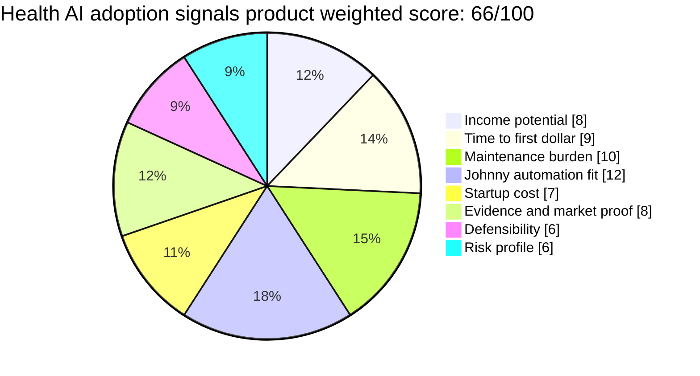

# Health AI Adoption Signals Product

**One-line thesis:** Track health AI startup launches, FDA approval signals, medical AI hiring patterns, vertical AI workflow adoption, and health AI funding rounds as a recurring intelligence product for health tech investors, health system operators, and healthcare AI builders.

- Parent category: Data product
- Featured date: 2026-04-30
- Current rank: 18 after post-feature correction
- Current score: 66 after post-feature correction
- Rank movement vs prior pass: rank 15 → 13 due score-order repair; featured today for first coverage

## Report metadata
- Featured state: new contender; first featured report
- Eligibility bucket at selection time: first coverage queue
- Why this was featured today: Row 15 was the highest-quality unfeatured first-coverage candidate after Row 13 was featured on 2026-04-29. Fresh Crunchbase/NEA evidence strengthened the vertical AI workflow moat thesis, and prior health AI hiring signals already made the row decision-useful.
- Related inbox brief: [Idea Factory 2026-04-30](../../../../00%20Inbox/Idea%20Factory%202026-04-30.md)
- Related run summary: [2026-04-30 - Freshness and Contradiction Pressure Pass](../Research%20Runs/2026-04-30%20-%20Freshness%20and%20Contradiction%20Pressure%20Pass.md)
- Related source captures: [2026-04-30 source capture](../Sources/2026-04-30%20-%20Freshness%20and%20Contradiction%20Pressure%20Pass.md)
- Related ledger row: [Opportunity State Ledger](../../../../40%20Agent%20Nexus/Projects/Idea%20Factory/Opportunity%20State%20Ledger.md)

## Post-feature critique
Jaret correctly flagged this report as weaker than it initially looked: health AI adoption and job postings prove market movement, but they do not prove people will pay for a newsletter/report. The opportunity should be treated as provisional until direct paid-demand evidence appears — ideally gig/request-for-work postings asking for health AI trend monitoring, or comparable paid report/newsletter proof.

## 2. Snapshot panel
- Evidence status: adoption signal only; needs buyer proof
- Johnny fit: high
- Maintenance shape: medium; sourcing requires watching multiple healthcare and AI surfaces
- Monetization path: subscription, premium health AI reports, investor/operator alert tiers
- Why it is featured today: it combines active health AI market movement with a clear Johnny monitoring advantage and first-coverage priority.

## 3. Offer
### What the product is
A recurring health AI adoption intelligence feed. Johnny monitors health AI startup launches, public FDA/device signals, funding rounds, implementation-focused job titles, health system AI announcements, and healthcare-specific AI workflow products. The output is a ranked signal feed showing which health AI categories are moving from hype to deployment.

### Who pays
- Health tech investors tracking which health AI categories are reaching operational maturity
- Health system innovation teams deciding which AI workflows deserve attention
- Healthcare AI founders watching adjacent adoption signals and competitive movement
- Consultants or analysts serving healthcare operators and investors

### What they get
- Weekly or biweekly health AI adoption signal report
- Category-level momentum ranking, such as ambient clinical documentation, patient engagement, medical imaging, operations automation, and AI implementation roles
- Alert list for notable job-title emergence, funding rounds, FDA activity, or hospital adoption signals
- Premium deep dives on one health AI subcategory

### What keeps the product useful over time
Health AI adoption is dynamic and regulated. Buyers need repeated synthesis because new FDA activity, hiring, funding, and implementation signals change which categories are actually deployable. Johnny can maintain the watching loop more consistently than a manual analyst.

## 4. Why now
### Demand shifts
Vertical AI is moving from “shiny object” to operational workflow. The Crunchbase/NEA article explicitly framed AI moats as last-mile workflow ownership and finished work products, not model differentiation alone. Healthcare is one of the clearest markets where last-mile adoption friction is high.

### Trend or market signals
Existing project evidence includes Navina posting an “AI Adoption Engineer” role, Terra API hiring for health AI market intelligence, CoffeeSpace with Scale AI Angels backing, MDalgorithms as a scaled health AI consumer product, and 4,000+ health AI startup jobs in LinkedIn evidence from prior runs.

### Pricing or launch signals
The pass did not validate a specific price point. The likely pricing wedge is a low-cost recurring intelligence subscription for founders/investors and a higher-priced custom report tier for health tech operators or consultants.

### What changed recently that made this more interesting now
The NEA vertical AI moat evidence gave the health AI adoption row a stronger theoretical base: durable AI application companies win by solving last-mile workflow holes. Health AI adoption signals can track where those holes are being filled in the market.

## 5. Proof and signals
### Strongest source-backed claims
- Crunchbase/NEA: vertical AI moats are being built around last-mile workflow problems and end-to-end artifacts.
- Existing evidence: Navina’s “AI Adoption Engineer” role indicates AI implementation support has become a named operational function.
- Existing evidence: Terra API, CoffeeSpace, MDalgorithms, and health AI job volume show active health AI hiring and company formation.

### Public market signals
- AI-focused companies dominate recent unicorn formation according to Crunchbase News.
- Health AI and biotech appeared in large funding-round coverage in Crunchbase News.
- Healthcare AI adoption requires implementation and compliance context, making raw launch/funding data less useful without interpretation.

### Contradictions or caution signals
- Healthcare is regulated and slower-moving; adoption signals may lag hype.
- The product could become a generic health tech newsletter unless it stays focused on implementation/adoption signals.
- FDA and health system data may be fragmented and require careful sourcing.
- Buyer validation is still missing: direct willingness to pay from health tech investors/operators has not yet been proven.

### Source trail
- [2026-04-30 source capture](../Sources/2026-04-30%20-%20Freshness%20and%20Contradiction%20Pressure%20Pass.md)
- [Crunchbase/NEA vertical AI article](https://news.crunchbase.com/venture/startups-buiding-moats-vertical-ai-luck-nea/)
- [Crunchbase News](https://news.crunchbase.com/)

## 6. Market gap
### What existing options miss
General healthcare newsletters and AI news feeds report launches and funding, but they often do not rank signals by adoption maturity. Enterprise databases track companies, not necessarily workflow implementation pressure.

### What this opportunity does better
It filters for adoption signals: implementation job titles, health-system workflow deployment, FDA-related movement, funding momentum, and subcategory maturity. The result is not “health AI news,” but “which health AI wedges are becoming operational.”

### Wedge or defensibility angle
The defensibility comes from the monitoring taxonomy, signal scoring, and longitudinal memory. If Johnny learns which signal combinations predict real deployment, the feed becomes more useful over time.

## 7. Execution path
### Minimum viable offer
A weekly Markdown/email report covering 5 to 8 health AI categories with a small scored signal table, one featured category, and source links.

### Likely acquisition wedge and first buyer-finding motion
Start with health tech investors, healthcare innovation consultants, and health AI founder communities. The first audience-building motion should be public teardown-style posts: “This week in health AI adoption signals,” with one concrete signal explained.

- Publish a sample signal map for 3 categories.
- Share a concise weekly post in health tech/startup circles.
- Offer a low-cost paid tier for the full source-backed report.
- Interview 3 to 5 health tech operators to test which signals they already track manually.

### Likely first data or content loop
Monitor Crunchbase/health tech news, FDA AI-related updates, YC/health AI hiring pages, hospital AI announcements, and LinkedIn/job-board signals where accessible.

### Main risks that would need validation next
- Whether buyers pay for a standalone health AI adoption feed
- Whether the signal set is fresh enough weekly
- Whether healthcare sourcing can stay compliant and lightweight
- Whether a narrow subcategory should be chosen first

## 8. Framework fit
### Rubric pie chart

### Rubric breakdown
- Income potential: **2/5 -> 8/20**. Plausible buyer, but no direct proof that buyers pay for this specific newsletter/report shape.
- Time to first dollar: **3/5 -> 9/15**. A report MVP is fast, but buyer discovery takes work.
- Maintenance burden: **3/5 -> 10/20**. Medium burden because the signal set spans funding, FDA, hiring, and health-system adoption.
- Johnny automation fit: **4/5 -> 12/15**. Monitoring and synthesis are strong Johnny fits.
- Startup cost: **4/5 -> 7/10**. Public-source intelligence product with low capital needs.
- Evidence and market proof: **3/5 -> 8/10**. Strong adoption evidence, but weak direct paid-demand evidence.
- Defensibility: **3/5 -> 6/15**. Defensibility is taxonomy and synthesis quality, not proprietary data.
- Risk profile: **3/5 -> 6/10**. Healthcare regulation and buyer validation remain risks.
- Total weighted score: **66/100**

### Why Johnny helps materially
Johnny can maintain the cross-surface watch loop: funding, jobs, FDA/public regulatory signals, startup launches, and health-system announcements. The product value is the synthesis, scoring, and longitudinal memory, not just one article or feed.

### Hidden burden or fragility
The product could degrade into a generic newsletter if it does not keep a strict adoption-signal taxonomy. Healthcare source quality is uneven, and regulatory context matters.

### Why this should stay near the top, move up, move down, or split
It should stay live because the adoption-signal wedge is clear and automatable. It should move up if direct buyer validation lands. It should move down if health AI buyers already get sufficient signal from existing newsletters or databases. It may need to split into a narrower subcategory such as ambient clinical documentation, medical imaging, or healthcare operations AI.

## 9. Next move
### What the next bounded pass should try to learn
Find direct evidence that health tech investors/operators pay for health AI monitoring, market maps, or adoption intelligence. If possible, identify 3 comparable paid products or consulting/report formats.

### What would cause promotion, demotion, split, or graduation into a downstream validation project
- Promotion: paid-product proof or direct buyer demand for adoption signals
- Demotion: evidence that existing health tech newsletters/databases fully satisfy the need
- Split: one subcategory clearly dominates the signal quality
- Graduation: Jaret chooses to test a sample weekly report with a real audience

## Short summary for inbox pointer
Today’s featured opportunity is the Health AI adoption signals product: a recurring intelligence feed that tracks which health AI categories are moving from hype to real deployment. It won today because fresh vertical AI evidence reinforced the last-mile workflow moat, while existing health AI hiring and adoption signals make it the strongest unfeatured first-coverage candidate.

#idea-factory #featured #health-ai #research
