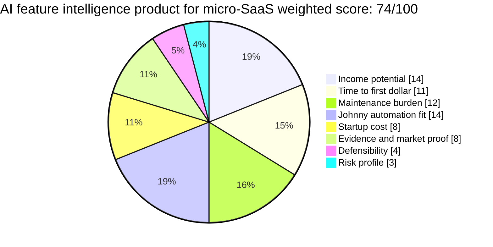

# AI Feature Intelligence Product for Micro-SaaS

**One-line thesis:** Track which features, pricing patterns, and product moves are gaining adoption across micro-SaaS categories so builders can see what is becoming table-stakes versus where a gap remains.

- Parent category: Data product
- Featured date: 2026-05-01
- Current rank: 7
- Current score: 74
- Rank movement vs prior pass: rank 13 → 7; score 71 → 74

## Report metadata
- Featured state: promoted; still provisional
- Eligibility bucket at selection time: first coverage queue
- Why this was featured today: It was the top first-coverage candidate and today’s research supplied the missing paid-demand bridge: Seeto validates solo-founder SaaS competitive-intelligence pricing, RivalSense validates weekly competitor-signal feeds, and Upwork snippets show directional paid demand for SaaS competitor research.
- Related inbox brief: [Idea Factory 2026-05-01](../../../../00%20Inbox/Idea%20Factory%202026-05-01.md)
- Related run summary: [2026-05-01 - AI Feature Intelligence Buyer-Demand Drill-Down](../Research%20Runs/2026-05-01%20-%20AI%20Feature%20Intelligence%20Buyer-Demand%20Drill-Down.md)
- Related source captures: [2026-05-01 source capture](../Sources/2026-05-01%20-%20AI%20Feature%20Intelligence%20Buyer-Demand%20Drill-Down.md)
- Related ledger row: [Opportunity State Ledger](../../../../40%20Agent%20Nexus/Projects/Idea%20Factory/Opportunity%20State%20Ledger.md)

## 2. Snapshot panel
- Evidence status: promising; direct monetization proof now exists, but buyer-volume proof is still needed
- Johnny fit: very high
- Maintenance shape: low once the monitoring and synthesis pipeline is stable
- Monetization path: subscription, premium tier, feature-adoption reports, category deep dives
- Why it is featured today: it moved from provisional new row to credible paid-data-product candidate after monetization and comparable-product evidence landed.

## 3. Offer
### What the product is
A recurring intelligence feed for micro-SaaS builders that tracks which product features, pricing patterns, integrations, AI capabilities, onboarding flows, and packaging choices are spreading across small SaaS categories.

The output is not a competitor matrix for one company. It is a category-level feature-adoption radar: what is becoming table-stakes, what is still differentiating, and which gaps small builders can exploit.

### Who pays
- Solo founders and indie hackers deciding what to build next
- Micro-SaaS founders prioritizing product roadmap work
- Tiny B2B SaaS teams without formal competitive intelligence
- Product marketers or agencies serving small SaaS teams
- Studios evaluating which micro-SaaS products to build or acquire

### What they get
- Weekly or biweekly category feature-adoption report
- “Becoming table-stakes” and “still differentiating” feature lists
- Pricing and packaging movement notes
- Changelog / launch-surface summaries by category
- Premium deep dives for one niche, such as support tools, analytics add-ons, AI agents, CRM extensions, or vertical workflow SaaS

### What keeps the product useful over time
SaaS features decay from differentiators into defaults. Builders need repeated synthesis because launch pages, changelogs, pricing pages, Product Hunt launches, communities, and competitor sites constantly move. Johnny’s advantage is the persistent monitoring loop and memory of what changed.

## 4. Why now
### Demand shifts
AI-assisted SaaS building is making product creation faster, which raises the value of knowing which features are already commoditized. Small builders need sharper signal before they spend time cloning features that no longer differentiate.

### Trend or market signals
The 2026-05-01 source capture found accessible comparable products around SaaS competitive intelligence and weekly competitor updates. The strongest signal is that this category is already monetized for lean SaaS teams.

### Pricing or launch signals
[Seeto pricing](https://seeto.ai/pricing) positions its Standard plan “for solo founders” at $29/mo with competitive feature matrices, pricing comparison, messaging analysis, battle cards, and PDF export. [RivalSense](https://rivalsense.co/) validates weekly competitor updates across product/features, distribution, customers, hiring, and other monitored signals.

### What changed recently that made this more interesting now
Yesterday the row was promising but under-validated. Today’s evidence confirmed that people pay for SaaS competitive intelligence at founder-friendly price points. That does not prove this exact product yet, but it clears the minimum monetization bridge for a modest promotion.

## 5. Proof and signals
### Strongest source-backed claims
- [Seeto pricing](https://seeto.ai/pricing) proves a solo-founder SaaS competitive-intelligence product can charge around $29/mo for feature matrices, pricing comparison, positioning maps, battle cards, and exports.
- [RivalSense](https://rivalsense.co/) proves the recurring weekly monitored-signal format: competitor product/features, distribution, new markets, hiring, legal/financial/M&A, and email/Slack delivery.
- Upwork indexed snippets showed paid SaaS competitive-analysis and benchmarking requests, including a snippet for a $20 test task that could become ongoing work if insights were strong.

### Public market signals
- Competitive intelligence is already being productized for SaaS teams.
- Weekly signal feeds can be positioned as a cleaner alternative to noisy alerts.
- Founder-friendly pricing exists, which matters because the target buyer is not an enterprise analyst team.

### Contradictions or caution signals
- Generic competitor monitoring is already crowded.
- Seeto and RivalSense are proof and competition at the same time.
- Upwork evidence was snippet-only because direct fetch was challenge/403 blocked, so it should not be over-weighted.
- Direct micro-SaaS community demand was not gathered today and remains the next validation gap.

### Source trail
- [2026-05-01 source capture](../Sources/2026-05-01%20-%20AI%20Feature%20Intelligence%20Buyer-Demand%20Drill-Down.md)
- [Seeto pricing](https://seeto.ai/pricing)
- [RivalSense](https://rivalsense.co/)

## 6. Market gap
### What existing options miss
Existing tools are mostly company-by-company competitor monitoring. They help a team watch named competitors, but they do not necessarily tell a small builder which features are becoming table-stakes across a category or which gaps remain under-served.

### What this opportunity does better
It turns scattered competitive updates into product-build intelligence. The focus is category-level feature adoption, not just “your competitor changed a page.”

### Wedge or defensibility angle
The wedge is taxonomy, longitudinal memory, and synthesis quality. Johnny can maintain category maps, classify feature movement, detect repeated patterns, and turn source noise into roadmap-relevant summaries.

## 7. Execution path
### Minimum viable offer
A weekly Markdown/email report for one micro-SaaS category with:
- 5 to 10 notable feature/pricing/product moves
- one “becoming table-stakes” section
- one “still differentiating” section
- one “gap to exploit” section
- source links and a small change log

### Likely acquisition wedge and first buyer-finding motion
Start with indie hackers, micro-SaaS founders, product-build communities, and tiny SaaS agencies. The first public wedge should be a free sample category teardown: “What changed this week in AI support tools / analytics add-ons / CRM extensions.”

- Publish 2 to 3 free sample reports in one tight category.
- Share concise takeaways in founder communities without pitching too hard.
- Ask founders which feature movements they already track manually.
- Offer a paid niche-specific watchlist if the sample gets meaningful replies.

### Likely first data or content loop
Monitor launch pages, changelogs, pricing pages, Product Hunt launches, GitHub releases where relevant, public founder posts, and competitor homepages for one narrow micro-SaaS category.

### Main risks that would need validation next
- Whether founders want category-wide feature intelligence or only competitor-specific monitoring
- Whether enough fresh changes occur weekly in a narrow category
- Whether public data is stable enough without heavy scraping
- Whether generic CI tools compress pricing too low for a standalone niche report

## 8. Framework fit
### Rubric pie chart

### Rubric breakdown
- Income potential: **3.5/5 -> 14/20**. Founder-friendly paid CI exists, but the ceiling depends on proving micro-SaaS category demand.
- Time to first dollar: **3.5/5 -> 11/15**. A sample report can be produced quickly; paid conversion still requires audience testing.
- Maintenance burden: **3/5 -> 12/20**. Monitoring can be automated, but taxonomy upkeep and interpretation still matter.
- Johnny automation fit: **4.5/5 -> 14/15**. Persistent monitoring, extraction, ranking, and synthesis are excellent Johnny fits.
- Startup cost: **4/5 -> 8/10**. Public-source report product; low capital cost.
- Evidence and market proof: **4/5 -> 8/10**. Seeto and RivalSense prove adjacent monetization; Upwork snippets add directional paid demand.
- Defensibility: **1.5/5 -> 4/15**. Generic CI is crowded; defensibility must come from niche taxonomy and synthesis.
- Risk profile: **1.5/5 -> 3/10**. Competition, buyer-volume uncertainty, and possible overlap with broader founder intelligence keep risk high.
- Total weighted score: **74/100**

### Why Johnny helps materially
Johnny can keep the longitudinal memory: which features appeared where, which patterns repeated, which categories are heating up, and which claims were already seen before. The product’s value is not one scrape; it is repeated synthesis over time.

### Hidden burden or fragility
If the output becomes a generic competitor watchlist, it loses. The hard part is maintaining a useful category taxonomy and translating scattered changes into decisions a builder can act on.

### Why this should stay near the top, move up, move down, or split
It should move up if direct community demand or paid subscriber interest appears. It should stay below the current top 5 until buyer-volume proof lands. It should move down if existing CI tools fully satisfy the need or if founder interest is limited to one-off competitor checks. It may split later by niche if one micro-SaaS category shows much stronger demand.

## 9. Next move
### What the next bounded pass should try to learn
Look for direct founder/community demand: Product Hunt comments, Indie Hackers, Reddit, X, founder newsletters, and micro-SaaS communities where builders ask what features to build, copy, or avoid.

### What would cause promotion, demotion, split, or graduation into a downstream validation project
- Promotion: direct buyer-volume proof or paid interest from micro-SaaS builders
- Demotion: evidence that founders only want existing generic CI tools or free competitor checks
- Split: one niche category clearly produces stronger demand and fresher signal
- Graduation: Jaret chooses to test a sample weekly report with a real audience

## Short summary for inbox pointer
Today’s featured idea is an AI feature intelligence product for micro-SaaS: a recurring feed that tracks which features, pricing patterns, and product moves are becoming table-stakes across small SaaS categories. It was promoted to score 74 because Seeto and RivalSense validate paid SaaS competitive-intelligence products, but the defensible wedge has to stay narrower than generic competitor monitoring.

#idea-factory #featured #micro-saas #research