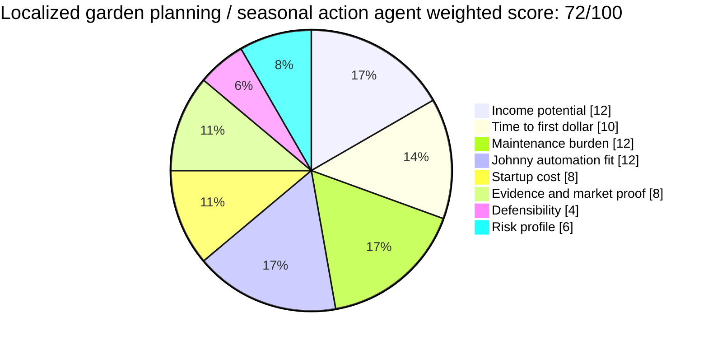

# Localized Garden Planning / Seasonal Action Agent

**One-line thesis:** Sell a hyperlocal weekly garden action assistant that tells gardeners what to start, plant, transplant, protect, buy, harvest, or prep next based on their zone, crop list, garden setup, and season.

- Parent category: Consumer planning / affiliate data product
- Featured date: 2026-05-02
- Current rank: 14
- Current score: 72
- Rank movement vs prior pass: rank 15 → 14; score 70 → 72

## Report metadata
- Featured state: promoted; first featured
- Eligibility bucket at selection time: first coverage queue
- Why this was featured today: It was the tracker’s top first-coverage candidate, and today’s source capture directly improved the prior paid-behavior and retention gap using GrowVeg, Seedtime, and Planter evidence.
- Related inbox brief: [Idea Factory 2026-05-02](../../../../00%20Inbox/Idea%20Factory%202026-05-02.md)
- Related run summary: [2026-05-02 - Localized Garden Planning Monetization and Retention Check](../Research%20Runs/2026-05-02%20-%20Localized%20Garden%20Planning%20Monetization%20and%20Retention%20Check.md)
- Related source captures: [2026-05-02 source capture](../Sources/2026-05-02%20-%20Localized%20Garden%20Planning%20Monetization%20and%20Retention%20Check.md)
- Related ledger row: [Opportunity State Ledger](../../../../40%20Agent%20Nexus/Projects/Idea%20Factory/Opportunity%20State%20Ledger.md)

## 2. Snapshot panel
- Evidence status: promising; paid app behavior validated, distribution still open
- Johnny fit: high
- Maintenance shape: low to medium; local calibration, crop taxonomy, weather variation, and support expectations add upkeep
- Monetization path: subscriptions, printable seasonal kits, premium local calendars, affiliate links
- Why it is featured today: direct pricing, retention, and adoption evidence made the row decision-useful enough for first coverage and a modest promotion.

## 3. Offer
### What the product is
A weekly or seasonal action feed for home gardeners. Instead of asking users to design a full garden plan from scratch, it answers the practical recurring question: “What should I do in my garden this week?”

The first version could generate a zone- and crop-aware checklist covering seed starting, transplanting, pruning, frost/heat protection, pest watch-outs, harvesting, soil prep, and what to buy now.

### Who pays
- Beginner-to-intermediate home gardeners who want confidence without becoming planning experts
- Raised-bed and container gardeners with limited space
- Busy families trying to grow food but forgetting seasonal tasks
- Gardeners who like printable plans, reminders, and local timing guidance
- Potentially local nurseries or garden educators if the product becomes a branded local calendar / kit

### What they get
- Weekly localized action checklist
- Printable seasonal plan for a specific zone, region, and garden type
- Planting, transplanting, protection, harvest, and prep reminders
- Optional seed/product shopping list with affiliate links
- Premium local calendar or crop-pack templates

### What keeps the product useful over time
Gardening is seasonal and recurring. The product becomes useful again when weather changes, planting windows approach, crops mature, pests appear, or the gardener plans next season. Johnny’s role is to maintain the calendar logic, local assumptions, and recurring reminders.

## 4. Why now
### Demand shifts
Consumers already pay for digital garden-planning help. The strongest opportunity is not “another planner app,” but a lighter recurring action product that reduces planning friction.

### Trend or market signals
The source capture found multiple paid garden-planning products with subscription or lifetime pricing and recurring planning features. That moves the row from interest-aligned but provisional to credible paid consumer workflow.

### Pricing or launch signals
- [GrowVeg Garden Planner pricing](https://www.growveg.com/subscribeinfo.aspx): $35 recurring annual, $50 one-year, $85 two-year, plus reminders, planting lists, crop rotation, next-year planning, upgrades, and support.
- [Seedtime pricing](https://seedtime.us/pricing): free plan plus paid garden-planning tiers with AI planning, planting-date credits, calendars, custom crops/tasks, inventory, community, and future weather/records/analytics features.
- [Planter pricing](https://planter.garden/pricing): Premium at $24.99/year and Lifetime at $99.99.
- [Planter App Store page](https://apps.apple.com/us/app/planter-garden-planner/id1542642210): 4.7/5 from 2.3K ratings and free-with-in-app-purchases monetization.

### What changed recently that made this more interesting now
The prior row already matched Jaret’s gardening interest, but its paid-behavior and retention proof was still thin. Today’s evidence validates both: people pay for garden planning, and seasonal reminders/calendars create repeat use.

## 5. Proof and signals
### Strongest source-backed claims
- GrowVeg proves annual garden-planning subscriptions and seasonal retention hooks.
- Seedtime proves a freemium-to-paid planning workflow with AI planning, tasks, custom crops/varieties, inventory, and community.
- Planter proves low-price subscription/lifetime monetization and meaningful app-store adoption.

### Public market signals
- Consumers search for and compare garden-planning apps.
- Calendars, reminders, climate-aware scheduling, custom crops, and task tracking recur across the category.
- Paid features are tied to convenience and ongoing plans, not just static information.

### Contradictions or caution signals
- Competition is real. Existing products already handle visual layouts, companion planting, plant databases, calendars, notes, and tasks.
- The product should not attempt to clone a polished full planner app.
- Local climate/weather quality, crop taxonomy, and support expectations can turn a “simple” planner into a maintenance burden.
- Affiliate revenue was not validated today; subscriptions and printable kits are stronger proof.

### Source trail
- [2026-05-02 source capture](../Sources/2026-05-02%20-%20Localized%20Garden%20Planning%20Monetization%20and%20Retention%20Check.md)
- [GrowVeg Garden Planner pricing](https://www.growveg.com/subscribeinfo.aspx)
- [Seedtime pricing](https://seedtime.us/pricing)
- [Planter pricing](https://planter.garden/pricing)
- [Planter App Store page](https://apps.apple.com/us/app/planter-garden-planner/id1542642210)

## 6. Market gap
### What existing options miss
Full garden-planner apps often require users to build and maintain a plan. That is powerful but can be too much for a busy or beginner gardener who mainly needs a trustworthy “do this next” guide.

### What this opportunity does better
It narrows to action timing and local context. The product can be simpler than a full planner: less layout design, more timely instructions, reminders, printable checklists, and local seasonal guidance.

### Wedge or defensibility angle
The wedge is local timing, recurring action synthesis, and practical packaging. A small product can start with one zone/region/crop bundle and produce a better weekly checklist than generic app notifications.

## 7. Execution path
### Minimum viable offer
A paid or free-to-paid weekly email/Markdown/PDF checklist for one gardening region and one garden type, such as raised-bed vegetables in a specific hardiness-zone band.

Include:
- this week’s tasks
- what to start indoors / direct sow / transplant
- weather or frost/heat watch-outs
- what to buy now
- one printable seasonal calendar
- source notes and local assumptions

### Likely acquisition wedge and first buyer-finding motion
Start narrow and local. A broad garden app would be hard to win; a local seasonal checklist can be tested cheaply.

- Publish a free sample weekly action plan for one zone/region.
- Share it in local gardening groups or with a local nursery/community garden.
- Offer a paid seasonal PDF/calendar pack.
- Ask what tasks gardeners forget and which reminders they would actually pay for.

### Likely first data or content loop
Use public planting calendars, extension-office guidance, seed packet windows, weather/frost data, and crop-specific checklists, then convert them into a weekly action feed for one defined region and garden setup.

### Main risks that would need validation next
- Cheap customer acquisition
- Whether gardeners prefer a lightweight weekly feed over existing apps
- Local data quality and support burden
- Whether printable kits or subscriptions convert better

## 8. Framework fit
### Rubric pie chart

### Rubric breakdown
- Income potential: **3/5 -> 12/20**. Consumer subscriptions are validated, but ARPU is modest and acquisition is unproven.
- Time to first dollar: **3/5 -> 10/15**. A sample checklist or printable kit can be produced quickly; paid conversion still needs an audience.
- Maintenance burden: **3/5 -> 12/20**. Seasonal workflows are automatable, but local calibration, crop taxonomy, weather variation, and support add upkeep.
- Johnny automation fit: **4/5 -> 12/15**. Johnny can maintain calendars, reminders, crop logic, and recurring weekly synthesis.
- Startup cost: **4/5 -> 8/10**. A content/feed MVP is cheap to test.
- Evidence and market proof: **4/5 -> 8/10**. GrowVeg, Seedtime, and Planter validate paid behavior; Planter adds app-store adoption proof.
- Defensibility: **1.5/5 -> 4/15**. Existing apps are credible; defensibility must come from local action quality and packaging.
- Risk profile: **3/5 -> 6/10**. Competition and acquisition risk remain, but the product can be tested narrowly.
- Total weighted score: **72/100**

### Why Johnny helps materially
Johnny can translate static regional planting guidance into recurring reminders and action lists. The value is not a plant database by itself; it is remembering what matters this week for a specific gardener.

### Hidden burden or fragility
Support expectations can grow if gardeners treat the assistant like expert agronomy advice. The product should be clear about assumptions and start narrow enough that local recommendations stay reliable.

### Why this should stay near the top, move up, move down, or split
It moved up modestly because paid behavior and retention proof improved. It should stay below stronger data-product rows until distribution and differentiation are clearer. It should move up if a cheap local acquisition channel or paid seasonal-kit demand appears. It should move down if existing apps fully satisfy the weekly action use case or if support/localization burden proves too high.

## 9. Next move
### What the next bounded pass should try to learn
Look for demand and acquisition proof: local gardening communities, gardening newsletters, nursery/community-garden partnerships, printable seasonal kit sales, or search/community evidence that gardeners want weekly action reminders rather than full app planning.

### What would cause promotion, demotion, split, or graduation into a downstream validation project
- Promotion: cheap acquisition proof, paid printable-kit sales, or clear community demand for local weekly action plans
- Demotion: evidence that existing apps already dominate the weekly-action use case or that support burden is too high
- Split: one region/crop/gardener type shows much stronger demand
- Graduation: Jaret chooses to test a local sample checklist or seasonal PDF/calendar pack

## Short summary for inbox pointer
Today’s featured opportunity is a localized garden planning / seasonal action agent: a weekly guide for what to plant, start, transplant, protect, buy, or harvest next. It moved to score 72 because GrowVeg, Seedtime, and Planter validate paid garden-planning behavior and seasonal retention, but the wedge should stay hyperlocal and action-oriented rather than cloning a full planner app.

#idea-factory #featured #garden-planning #research
